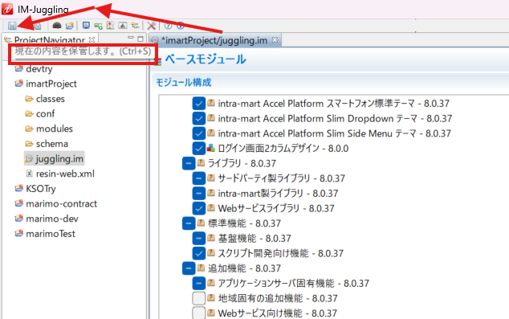
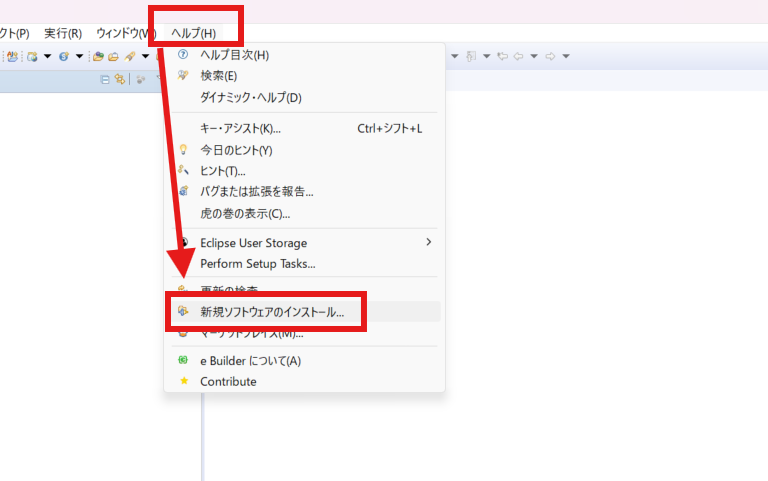

<h1 align="center">Intra Mart</h1>

<p align="center">
  
</p>

### EN Version
NTT DATA Intramart's digital process automation platform integrates various corporate business systems onto a unified platform, 
enabling IT investment efficiency and the optimization/standardization of business processes.


### JP Version
株式会社NTTデータ イントラマートが提供する、企業内の様々な業務システムを同一のプラットフォーム上に集約し、
IT投資の効率化と業務プロセスの最適化・標準化を実現するためのデジタルプロセスオートメーションプラットフォーム。

<h1 align="center">✨ Disclaimer ✨</h1>

- For more details about Intra-Mart, please refer to the official Intra-Mart website.
- この情報はIntra-Martに関する作成されたので、不明点があったら、Intra-Martの正式サイトをご覧ください。
##### リンク : `https://www.intra-mart.jp/`.


<h1 align="center">📖 Requirements 📖</h1>

- [Java 8](#java-8)
- [Resin](#resin)
- [PostgreSQL 16.9 (17以下) - Compatible Version](#postgresql)
- [Juggling](#juggling)
- [EBuilder](#ebuilder)
- [Notepad++ ・ VSCode](#notepad-vscode)
- [STMP 4 Dev](#stmp-4-dev)


<h1 align="center">💻 Installation 💻</h1>

⭐⭐⭐⭐⭐⭐
## Java 8
⭐⭐⭐⭐⭐⭐

> **Note:** If you want a free version, you can download OpenJDK from [Link Here](https://www.openlogic.com/openjdk-downloads)

> **ノート:** 無料版をご利用になりたい場合は、OpenJDKをダウンロードいただけます [ここにクリック](https://www.openlogic.com/openjdk-downloads)

<p align="left">
  
</p>

* Filter data to 8 version and download newest version (.msi)
* Java８バージョンを検索、最新のバージョンの方が良い (.msi)

<p align="left">
  
</p>

> **Note:** If Show nothing Need to check the **Environment variables**

> **ノート:** Javaバージョン確認の結果が見つからなかったら、**環境変数** 確認が必要

<p align="left">
  
</p>

<p align="left">
  
</p>


⭐⭐⭐⭐⭐⭐
## Resin
⭐⭐⭐⭐⭐⭐

> **Download Resin from the link below** 

> **Resinをダウンロードするため、以下のリンクをご覧ください** 

##### リンク : [Resin Download](https://download.intra-mart.jp/library/).

<p align="left">
  
</p>

> **Input License Key** 

> **ライセンスキーを入力** 

<p align="left">
  
</p>

> **Filter Category to Resin** 

> **カテゴリのところにResinを入力** 

<p align="left">
  
</p>


> **Extract Resin, Make sure to put it to C Drive** 

> **Resinを抽出し、Cドライブへ配置する必要があります。** 

<p align="left">
  
</p>

> **Go to conf folder and edit resin.properties (Please ensure that Uncommented and Commented sections are same)** 

> **conf/resin.properties を編集（コメントアウト状態に注意）** 

<p align="left">
  
</p>

<p align="left">
  
</p>


> **To Connect PostgreSQL Database to Resin (Intra-Mart), Need to download JDBC** 

> **PostgreSQL接続にはJDBCドライバが必要です** 

##### リンク : [JDBC Download](https://jdbc.postgresql.org/download/).

<p align="left">
  
</p>

> **Move the JDBC file to the lib folder inside the Resin folder.** 

> **ダウンロード後、libフォルダの中に移動** 

<p align="left">
  
</p>


> **Create lib-backup folder, (CTRL + X ) file that showed in green line** 

> **lib-backupフォルダを作成し、緑色ファイルは　(CTRL + X )を押し、作成されたフォルダに移動** 

<p align="left">
  
</p>


> **Setup Resin as Local Service, The Password is your own device password** 

> **Resin　はローカルサービスとして設定が必要, パスワードは自分のパソコンのパスワード** 

<p align="left">
  
</p>

> **After that you can check in (Task Manager > Services)** 

> **確認方法: タスクマネージャー > サービス** 

<p align="left">
  
</p>


⭐⭐⭐⭐⭐⭐
## PostgreSQL
⭐⭐⭐⭐⭐⭐

> **Download PostgreSQL from the link below** 

> **PostgreSQLをダウンロードするため、以下のリンクをご覧ください** 

##### リンク : [PostgreSQL Download](https://www.enterprisedb.com/downloads/postgres-postgresql-downloads).

> **For now Compatible version is 16.9** 

> **現在、１７以下のバージョンがおすすめ** 

<p align="left">
  
</p>

> **If you got Ps1 Error, Follow Guide Below** 
,If not you can go to PostgreSQL Setup [PostgreSQL Setup](#postgresql-setup)

> **PS1 エラーが発生したら、次のガイドをご覧ください、** 
なかったらPostgreSQL Setupに移動　[PostgreSQL Setup](#postgresql-setup)
<p align="left">
  
</p>

> **Open Powershell as Admin** 

> **PowerShellを検索、管理者として実行** 

<p align="left">
  
</p>

> **Copy and Paste Command Below to PowerShell** 

> **コピペ以下のコマンド、PowerShellに入力** 

```sh
mkdir C:\TempPG
set TEMP=C:\TempPG
set TMP=C:\TempPG
```

> **Move PostgreSQL.exe file to the path (C:\TempPG), and then setup variable environment (Don't Forget to create a backup)** 

> **PostgreSQL.exe ファイルを指定パス (C:\TempPG) に移動, 環境変数設定も必要 (バックアップの作成を忘れずに！)** 

<p align="left">
  
</p>

> **Execute PostgreSQL.exe as Admin** 

> **PostgreSQL.exe ファイルは管理者として実行** 

<p align="left">
  
</p>

#### PostgreSQL Setup

<p align="left">
  
</p>

<p align="left">
  
</p>

<p align="left">
  
</p>

<p align="left">
  
</p>

> **You can choose a password that you want, for example, (123).** 

> **パスワードは自由に入力、例として今回は（123）を入力** 

<p align="left">
  
</p>

<p align="left">
  
</p>

> **For the Locale, you can setup general locale (English, United States)** 

> **エラーを避けるため、ローカル設定は (English, United States)を入力した方が良い** 

<p align="left">
  
</p>

> **For the last part, if the pop up appears you can ignore it and press cancel** 

> **インストールした後で、以下の画面が表示したら、無視しても良い** 

<p align="left">
  
</p>


### Create Database

> **Search PgAdmin and Run as Admin** 

> **PgAdmin を検索、管理者として実行** 

<p align="left">
  
</p>


> **Input password that you already created before** 

> **先の決定されたパスワードを入力** 

<p align="left">
  
</p>


> **Create New imart Role For Intra-Mart Development** 

> **Intra-Mart開発のため、imartロールが必要** 

<p align="left">
  
</p>

<p align="left">
  
</p>

<p align="left">
  
</p>

<p align="left">
  
</p>

> **Create New Database For Intra-Mart Development** 

> **Intra-Mart開発のため、新しいデータベースが必要** 

<p align="left">
  
</p>

<p align="left">
  
</p>


⭐⭐⭐⭐⭐⭐
## Juggling
⭐⭐⭐⭐⭐⭐

> **Download Juggling from the link below** 

> **Jugglingをダウンロードするため、以下のリンクをご覧ください** 

##### リンク : [Juggling Download](https://download.intra-mart.jp/library/).

<p align="left">
  
</p>

> **Input License Key** 

> **ライセンスキーを入力** 

<p align="left">
  
</p>

> **Search Juggling using (CTRL + F) feature** 

> **キーボードで(CTRL + F)を押し、Jugglingを入力** 

<p align="left">
  
</p>


#### Juggling Setup

<p align="left">
  
</p>

<p align="left">
  
</p>

<p align="left">
  
</p>
<p align="left">
  
</p>

<p align="left">
  
</p>

<p align="left">
  
</p>

<p align="left">
  
</p>

<p align="left">
  
</p>

<p align="left">
  
</p>

> **Uncomment base URL and create your own URL name (For now we only run it on localhost)** 

> **エンドポイント名を自由に作成し、ベースURLからコメント解除されていない部分を削除（現在はlocalhostでのみ実行する）** 

<p align="left">
  
</p>

<p align="left">
  
</p>

> **Ensure created database in PostgreSQL are same** 

> **前回の作成したデータベース名、確認が必要** 

<p align="left">
  
</p>

<p align="left">
  
</p>

<p align="left">
  
</p>

<p align="left">
  
</p>


> **Make sure the file name in this section matches the URL name you previously created.** 

> **以前に作成したURL名と一致するように、このセクションのファイル名を確認してください。** 


<p align="left">
  
</p>

<p align="left">
  
</p>

> **For the country and language you can choose what you want** 

> **国、言語について自由に選択出来る** 

<p align="left">
  
</p>

<p align="left">
  
</p>


⭐⭐⭐⭐⭐⭐
### Execute Warfile
⭐⭐⭐⭐⭐⭐

> **We need to create a new resin folder because (1 Project 1 Resin Folder) and move all data from resin-main folder to new resin folder** 

> **新しい resin フォルダを作成し（1プロジェクト＝1 Resinフォルダのルールに従い）、resin-main フォルダ内の全データを新しい resin フォルダに移動してください** 


<p align="left">
  
</p>

<p align="left">
  
</p>

> **Run Resin.exe as Admin** 

> **Resin.exe ファイルは管理者として実行** 

<p align="left">
  
</p>

<p align="left">
  
</p>

> **In Command Prompt you need to copy path your resin folder（Need to add 'cd' command）** 

> **コマンドプロンプトの中にResinフォルダのパースをコピペ（ｃｄコマンド忘れないように）** 

<p align="left">
  
</p>

> **Add 'resin deploy' + (your warfile path) / (file.war)** 

> **'resin deploy (warfileフォルダパース) / (WARファイル)'を入力してください。** 

<p align="left">
  
</p>

<p align="left">
  
</p>

> **If you got Bean Error, you need to follow guide below** 
 if not just go to [Checkpoint Deploy](#checkpoint-deploy)

> **Beanエラーが発生したら、以下のガイドをご覧ください。**
なかったらCheckpoint Deployに移動 [Checkpoint Deploy](#checkpoint-deploy)

<p align="left">
  
</p>

> **Find (applicationContext-im_tgfw_common.xml) file inside deployed warfile** 

> **デプロイされたWarfileフォルダの中に(applicationContext-im_tgfw_common.xml)ファイルを探さないといけない。** 

<p align="left">
  
</p>

<p align="left">
  
</p>

> **Change Dozzer Setting with code below** 

> **Dozzer設定された部分に対して変更が必要** 

> **Before Edit, 編集前** 
```sh
<bean class="org.dozer.spring.DozerBeanMapperFactoryBean">
  <property name="mappingFiles" value="classpath*:/META-INF/dozer/**/*-mapping.xml" />
</bean>
```

> **After Edit, 編集後** 
```sh
<bean class="com.github.dozermapper.spring.DozerBeanMapperFactoryBean">
  <property name="mappingFiles" value="classpath*:/META-INF/dozer/**/*-mapping.xml" />
</bean>
```

<p align="left">
  
</p>


> **RESTART Resin.exe (Stop ⇒ Start)** 

> **Resin.exe再起動が必要  (Stop ⇒ Start)** 

<p align="left">
  
</p>

🚩🚩🚩
#### Checkpoint Deploy
🚩🚩🚩

<p align="left">
  
</p>

<p align="left">
  
</p>

<p align="left">
  
</p>


⭐⭐⭐⭐⭐⭐
## EBuilder
⭐⭐⭐⭐⭐⭐

> **Download EBuilder from the link below** 

> **EBuilderをダウンロードするため、以下のリンクをご覧ください** 

##### リンク : [EBuilder Download](https://download.intra-mart.jp/library/).

<p align="left">
  
</p>

> **Input License Key** 

> **ライセンスキーを入力** 

<p align="left">
  
</p>

> **Search ebuilder using (CTRL + F) feature** 

> **キーボードで(CTRL + F)を押し、ebuilderを入力** 

<p align="left">
  
</p>


> **Extract EBuilder, Make sure to put it to C Drive, and then modify ebuilder.ini file** 

> **EBuilderを抽出し、Cドライブへ配置し、ebuilder.iniファイル編集が必要** 

<p align="left">
  
</p>


🚩🚩🚩🚩🚩🚩
#### Create Ebuilder Project
🚩🚩🚩🚩🚩🚩

<p align="left">
  
</p>

<p align="left">
  
</p>

<p align="left">
  
</p>

<p align="left">
  
</p>

<p align="left">
  
</p>

<p align="left">
  
</p>


⭐⭐⭐⭐⭐⭐
### STMP 4 Dev
⭐⭐⭐⭐⭐⭐