<h1 align="center">Intra Mart</h1>

⬅️
[Back 戻る](../README.md)


<h2 align="left">⭐Tenant Setup⭐</h2>

<p align="left">
  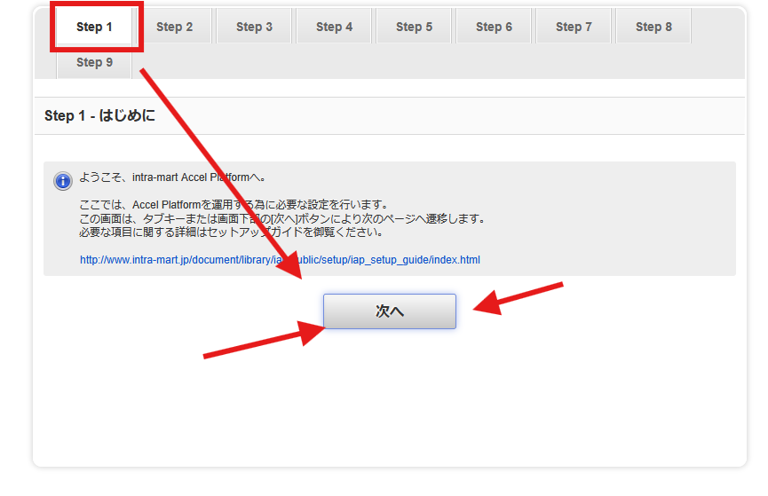
</p>

> **Usercode ユーザーコード** 

```sh
 system
```

> **Password パスワード** 

```sh
 system
```

<p align="left">
  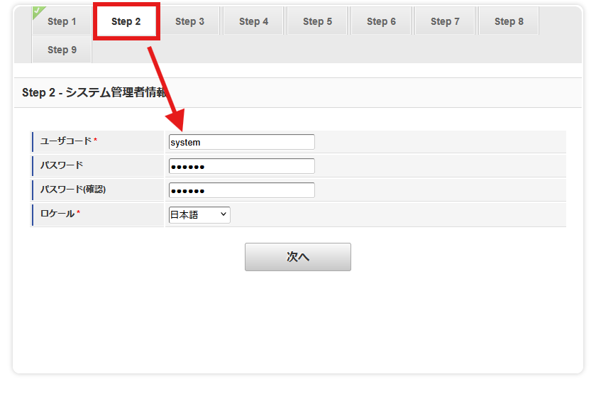
</p>

<p align="left">
  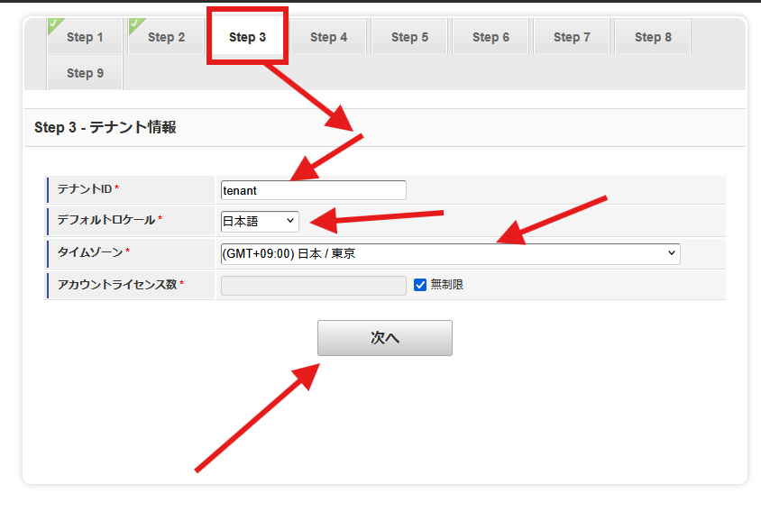
</p>

<p align="left">
  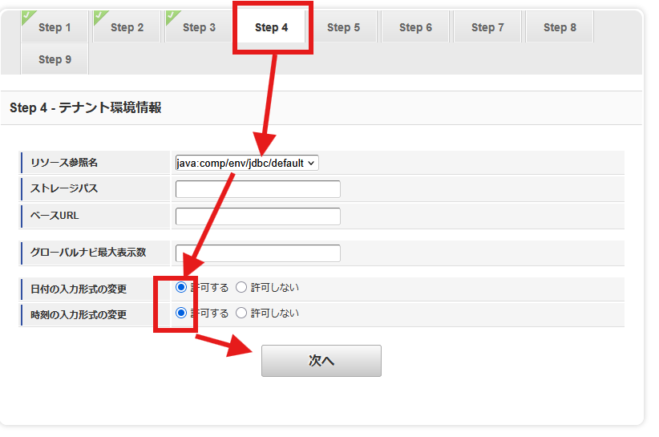
</p>

<p align="left">
  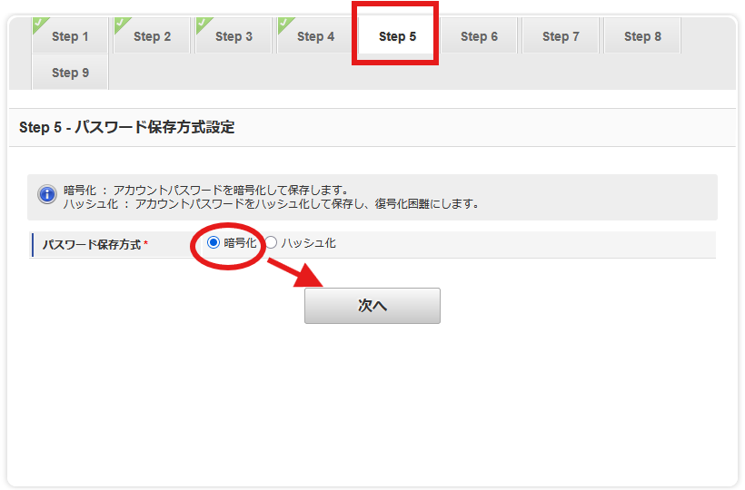
</p>

> **Usercode ユーザーコード** 

```sh
 tenant
```

> **Password パスワード** 

```sh
 tenant
```

<p align="left">
  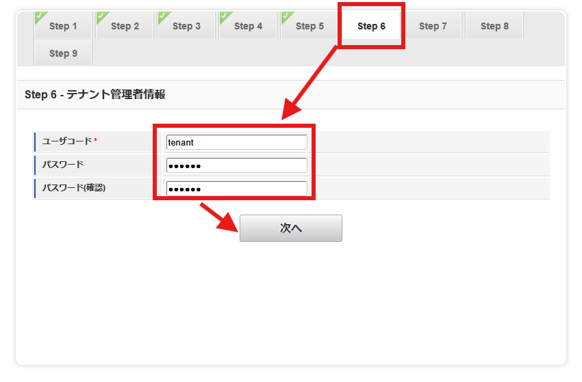
</p>

<p align="left">
  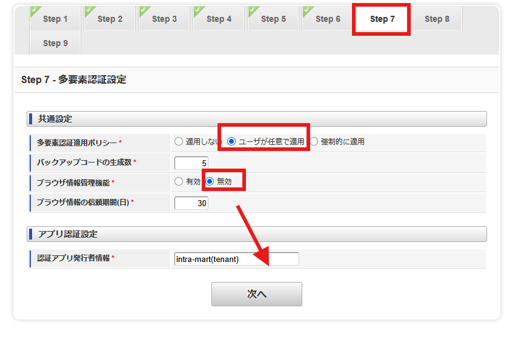
</p>

<p align="left">
  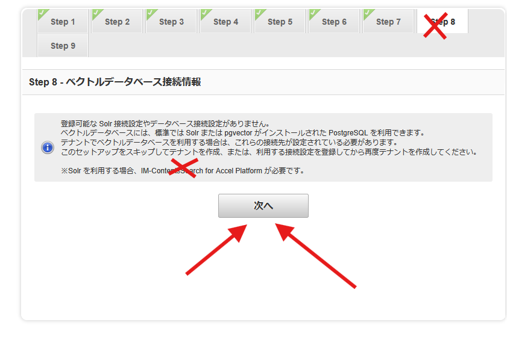
</p>

<p align="left">
  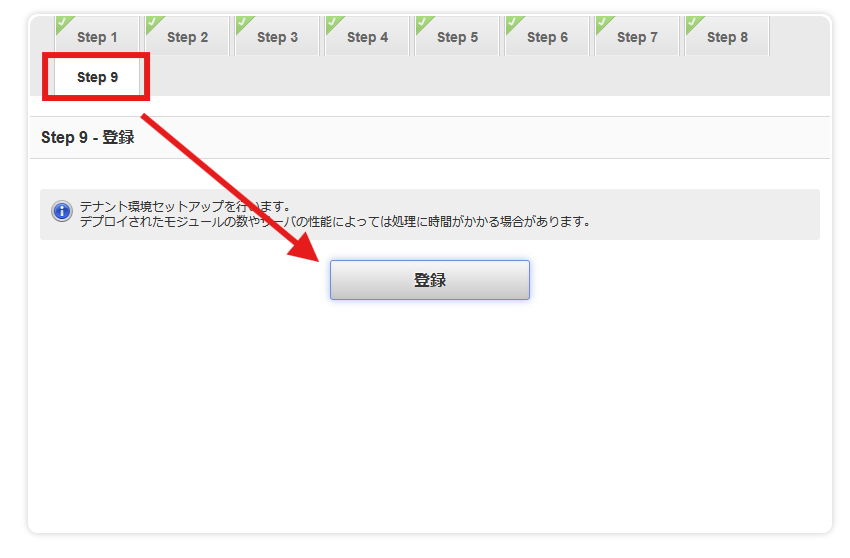
</p>

<p align="left">
  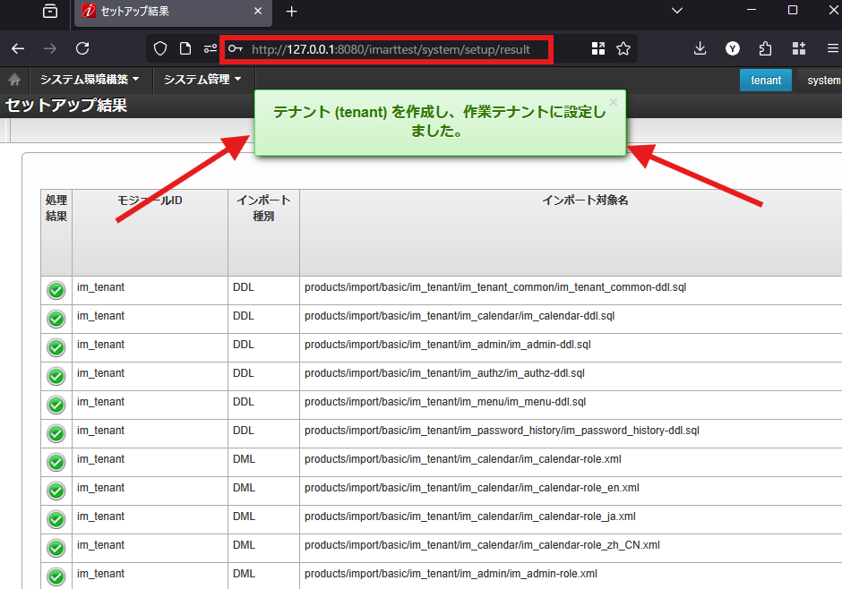
</p>

<p align="left">
  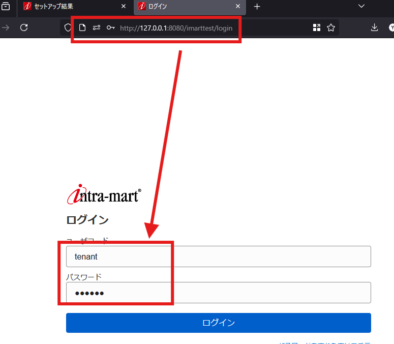
</p>

<p align="left">
  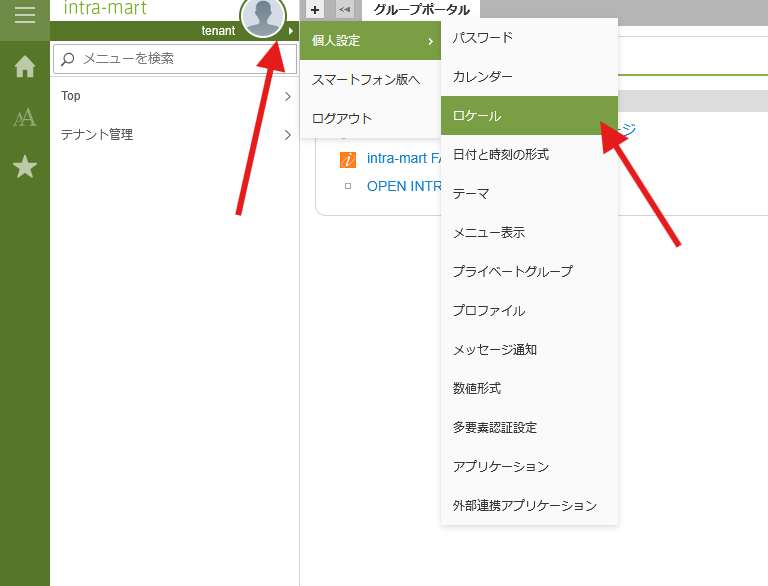
</p>

> **For the country and language you can choose what you want** 

> **国、言語について自由に選択出来る** 

<p align="left">
  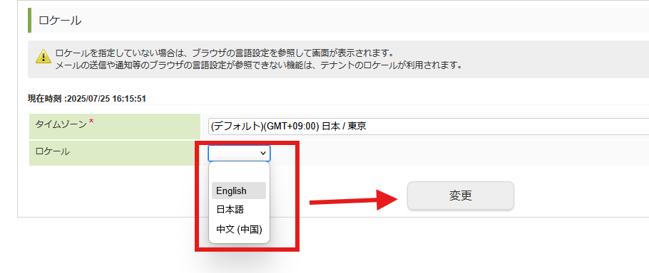
</p>

<p align="left">
  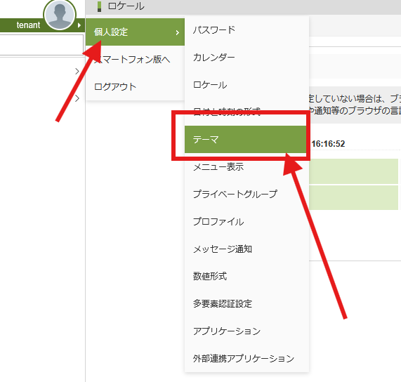
</p>

> **You can choose the theme** 

> **テーマは選び放題** 

<p align="left">
  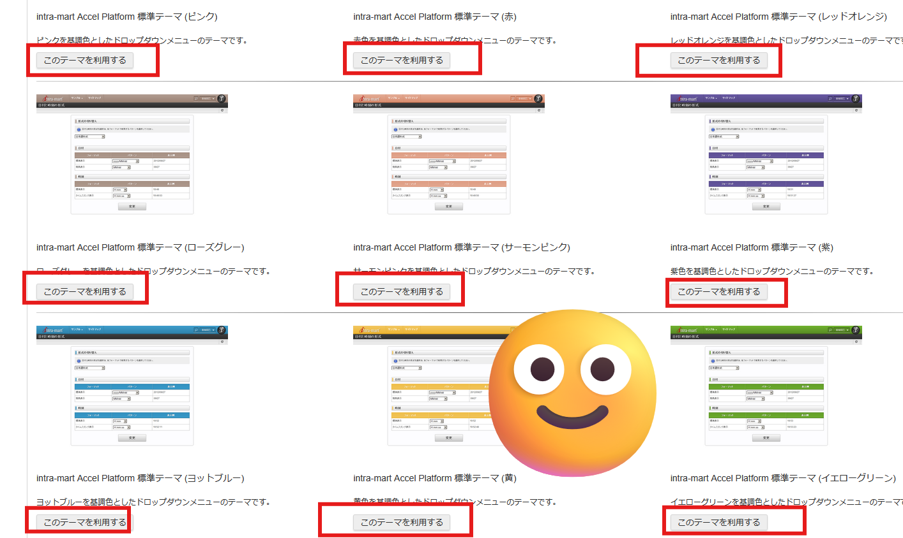
</p>

➡️
[Workflow Setup](../workflow_setup/workflow.md)

⬅️
[Back to README 戻る](../README.md)