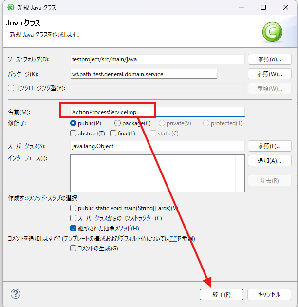
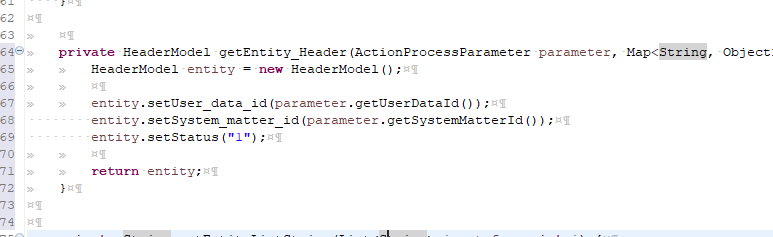
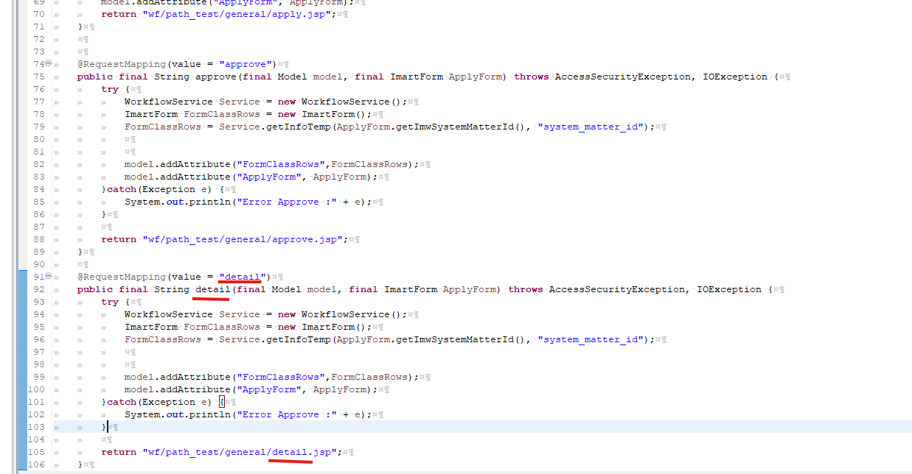
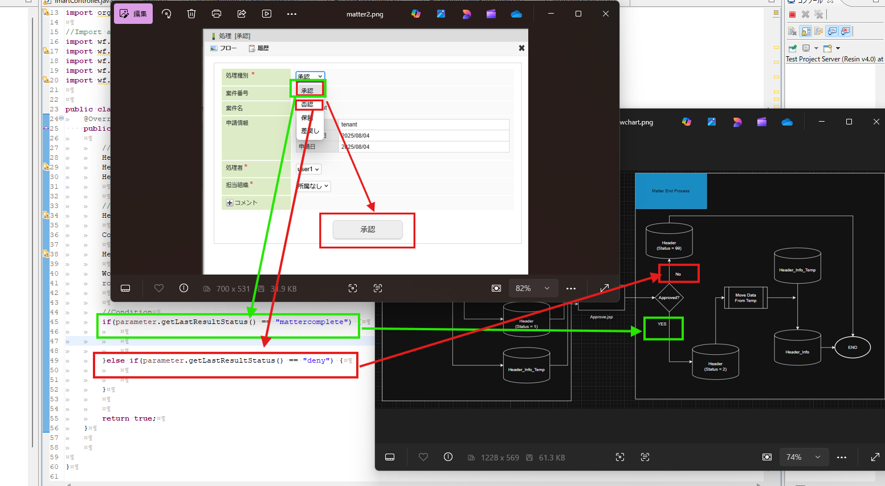
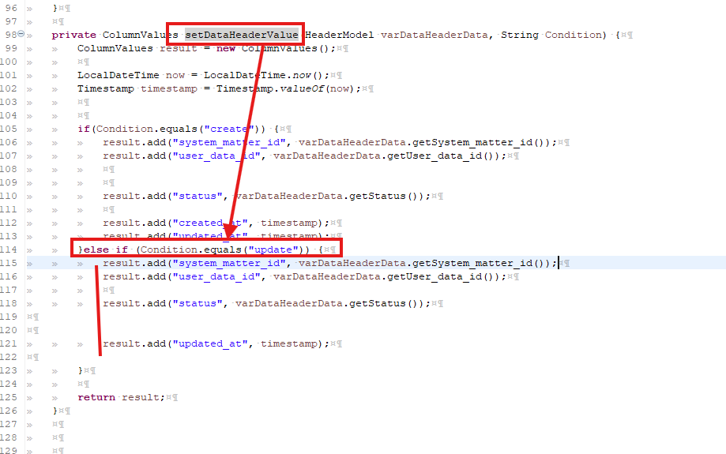

<h1 align="center">Intra Mart</h1>

⬅️
[Back 戻る](../README.md)


<h2 align="left">⭐CRUD Setup⭐</h2>

<p align="center">
  
</p>

Please follow the steps below (以下の手順に従ってください).

<h4 align="left">📖 Design (デザイン) </h4>
Create Screen
画面作成 

<h4 align="left">📖 Apply Action Process （申請処理）</h4>
Create Table　⇒　Create Model ⇒ Create Repository ⇒ Create Service Action 

テーブル作成 ⇒ モデル作成 ⇒ リポジトリ作成 ⇒ サービスアクション作成

<h4 align="left">📖 Process Data　（データ処理）</h4>
Get Data ⇒　Show data

データ取得 ⇒ データ表示

<h4 align="left">📖 Matter End Process　（案件終了処理）</h4>

Create Service MatterEnd ⇒ Update Database

案件終了サービス作成 ⇒ データベース更新

<h1 align="center">⏭️ Details (目次) ⏭️</h1>

1. [Design](#design)
    - [Apply JSP Sample Code](#sample-code-1)
    - [ER Diagram](#er-diagram)
    - [Flow Chart](#flow-chart)
    
2. [Apply Action Process](#apply-action-process)
    - [Create Database](#create-database)
    - [Create Model](#create-model)
    - [Create Repository](#create-repository)
    - [Create Action Service](#create-service)
        - [ActionProcessServiceImpl.java](#sample-code-2)
    - [Apply Testing](#apply-testing)

3. [Process Data](#process-data)
    - [Create Approve](#create-approve-screen)
      - [Sample Button](#sample-code-button)
      - [Sample Approve Controller](#sample-code-data)
    - [Retrieve Data](#retrieve-data)
      - [Import Module](#import-sample-1)
      - [Sample Select Data Info Temp](#sample-code-data-2)
      - [Sample Get Data Service](#sample-code-data-3)
      - [Full Approve Controller](#sample-code-data-4)
    - [Create Detail Screen](#detail-data)
3. [Matter End Process](#matter-end)
    - [Import Module](#sample-code-data-5)
    - [Sample MatterEndServiceImpl](#sample-code-data-6)
    - [Sample Select Data Header](#sample-code-data-7)
    - [Sample Move Data Info Temp to Data Info ](#sample-code-data-8)
    - [Sample Update Header](#sample-code-data-9)
    - [Sample Set Data Header](#sample-code-data-10)
    - [Full MatterEndServiceImpl](#sample-code-data-11)
4. [Case Testing](#testing)
    - [Accepted承認](#accepted-case)
    - [Rejected否認](#rejected-case)
    


<h3 align="center">🚩Design (デザイン)🚩</h3>

##### Design


> **First you need to create views (JSP) and set some input form** 

> **JSPファイルを作成、入力フォームを作成が必要** 

> **For example we create 3 input forms** 

> **例として、今回は３つの入力フォームを作成** 

<p align="left">
  
</p>


<p align="left">
  
</p>

#### Sample Code 1

> **Apply.jsp** 


```sh

<%@ page contentType="text/html; charset=utf-8" pageEncoding="utf-8"%>
<%@ taglib prefix="imui" uri="http://www.intra-mart.co.jp/taglib/imui"%>
<%@ taglib prefix="imart" uri="http://www.intra-mart.co.jp/taglib/core/standard"%>
<%@ taglib prefix="workflow" uri="http://www.intra-mart.co.jp/taglib/imw/workflow"%>
<%@ taglib prefix="form"   uri="http://www.springframework.org/tags/form"%>
<%@ taglib prefix="spring" uri="http://www.springframework.org/tags"%>
<%@ taglib prefix="f" uri="http://terasoluna.org/functions"%>
<%@ taglib prefix="c" uri="http://java.sun.com/jstl/core"%>
<%@ taglib prefix="im" uri="http://www.intra-mart.co.jp/taglib/im-tenant"%>

<%@ page import="java.util.List"%>
<%@ page import="java.util.ArrayList"%>
<%@ page import="java.util.Map"%>
<%@ page import="java.util.HashMap"%>

<imui:head>
	<title>Sample Workflow</title>
	<workflow:workflowOpenPageCsjs />
	
	<link href="ui/css/select2.min.css" rel="stylesheet" />
    <script src="ui/js/select2.min.js" type="text/javascript"></script>
    <script src="ui/js/jquery.validate.js" type="text/javascript"></script>
	
	
	
	<script type="text/javascript">
		

        $(function(){
           

            $('#openPage').click(function() {
   
            	
            	workflowOpenPage('${f:h(ApplyForm.imwPageType)}');
            	
                
            });  
        });   
	</script>
	

	
	<!-- CSS Scripts -->
    <style type="text/css">
        
    </style>
</imui:head>

<workflow:workflowUserContentsAuth imwApplyBaseDate='${f:h(ApplyForm.imwApplyBaseDate)}'
            imwAuthUserCode = '${f:h(ApplyForm.imwAuthUserCode)}'
            imwFlowId='${f:h(ApplyForm.imwFlowId)}'
            imwNodeId ='${f:h(ApplyForm.imwNodeId)}'
            imwPageType = '${f:h(ApplyForm.imwPageType)}'
            imwSystemMatterId='${f:h(ApplyForm.imwSystemMatterId)}'
            imwUserDataId='${f:h(ApplyForm.imwUserDataId)}'/>
            

<div class="imui-title-small-window">
	<h1>Workflow</h1>
</div>
<div class="imui-toolbar-wrap">
 	<div class="imui-toolbar-inner">
		<ul class="imui-list-toolbar">
			<li>
				<a href="javascript:void(0);" id="back">
					<span class="im-ui-icon-common-16-back"></span>
				</a>
			</li>
		</ul>
	</div>
</div>

<imui:tabs selected="0">
<imui:tabItem title="Workflow" >
	<div class="imui-form-container">
		<workflow:workflowOpenPage name="workflowOpenPageForm"
				id="workflowOpenPageForm"
				method="POST"
				target="_top"
				imwUserDataId="${f:h(ApplyForm.imwUserDataId)}"
				imwSystemMatterId="${f:h(ApplyForm.imwSystemMatterId)}"
				imwAuthUserCode="${f:h(ApplyForm.imwAuthUserCode)}"
				imwApplyBaseDate="${f:h(ApplyForm.imwApplyBaseDate)}"
				imwNodeId="${f:h(ApplyForm.imwNodeId)}"
				imwFlowId="${f:h(ApplyForm.imwFlowId)}"
				imwCallOriginalParams="${f:h(ApplyForm.imwCallOriginalParams)}"
				imwNextScriptPath="${f:h(ApplyForm.imwCallOriginalPagePath)}">	
				
		  		<header class="imui-chapter-title">
					<h2>Input Form</h2>
				</header>
				
				<table class="imui-form tab_header">
					<tbody>
						<tr>
							<th width="250">
								<label class="imui-required" style="margin-left:20px">Name</label>
							</th>
							<td>
								<input type="text" id="f_name" name="f_name" placeholder="Name.." style="height:20px" size="50">
								
							</td>
						</tr>
              
	                    <tr>
                    		<th>
	                            <label class="imui-required" style="margin-left:20px">Age</label>
	                        </th>
	                        <td>
	                            <div class="">
									<input type="number" id="f_age" name="f_age" min="0" max="500" placeholder="0">                              
	                            </div>
	                        </td>
	                            
	                    </tr>
	                    
	                    <tr>
	                    	<th width="250">
								<label style="margin-left : 20px">Notes</label>
							</th>
	                        <td>
	                            <div class="form-group">
	                                <textarea rows="3" 
	                                            cols="40" 
	                                            name="f_note" 
	                                            id="f_note" 
	                                            class=""
	                                            style="margin-left: 5px;"></textarea>
	                            </div>
	                        </td>
	                    </tr>
					</tbody>
				</table>
				
		</workflow:workflowOpenPage>
		
		
		
	</div>
	
</imui:tabItem>
</imui:tabs>


		
<!-- Button Default -->
<div class="imui-operation-parts">
	<imart:decision case="0" value="${f:h(ApplyForm.imwPageType)}">	
		<input type="button" value='Apply' id="openPage" name="openPage" class="imui-large-button"
			escapeXml="true" escapeJs="false" />
	</imart:decision>
	<imart:decision case="3" value="${f:h(ApplyForm.imwPageType)}">
		<input type="button" value='Re-Apply' id="openPage" name="openPage" class="imui-large-button"
			escapeXml="true" escapeJs="false" />
	</imart:decision>
	
</div>

<form name="backForm" id="backForm" method="POST" action="${f:h(ApplyForm.imwCallOriginalPagePath)}">
    <input type="hidden" name=imwCallOriginalParams value="${f:h(ApplyForm.imwCallOriginalParams)}" />
</form>

```


> **From the screen that we created, ERD shoud be like picture below** 

> **画面作成した後、データベースのイメージが以下の図に表示される** 

##### ER Diagram

<p align="left">
  
</p>

##### Flow Chart

> **処理フロー図** 

<p align="left">
  
</p>


<h3 align="center">🚩Apply Action Process （申請処理）🚩</h3>

### Apply Action Process

##### Create Database

> **Open PostgreSQL to create table in database that already created** 

> **PostgreSQLでの作成されたDBを開き、テーブルを作成** 

<p align="left">
  
</p>


> **Scroll to the bottom and you will get your own created table** 

> **作成されたテーブルは下にスクロールしてください** 

<p align="left">
  
</p>

<p align="left">
  
</p>

<p align="left">
  
</p>


<p align="left">
  
</p>

<p align="left">
  
</p>

<p align="left">
  
</p>

<p align="left">
  
</p>

<p align="left">
  
</p>

<p align="left">
  
</p>

<p align="left">
  
</p>

<p align="left">
  
</p>


#### Create Model

<p align="left">
  
</p>

<p align="left">
  
</p>

<p align="left">
  
</p>

<p align="left">
  
</p>

<p align="left">
  
</p>

<p align="left">
  
</p>


#### Create Repository

<p align="left">
  
</p>

<p align="left">
  
</p>

<p align="left">
  
</p>

<p align="left">
  
</p>

<p align="left">
  
</p>

<p align="left">
  
</p>

<p align="left">
  
</p>

#### Create Service

<p align="left">
  
</p>

<p align="left">
  
</p>

<p align="left">
  
</p>

<p align="left">
  
</p>


#### Sample Code 2

> **ActionProcessServiceImpl.java** 

```sh


import java.text.DateFormat;
import java.text.SimpleDateFormat;
import java.util.ArrayList;
import java.util.Collection;
import java.util.Collections;
import java.util.Date;
import java.util.List;
import java.util.Map;

import jp.co.intra_mart.common.aid.jdk.java.util.LocaleUtil;
import jp.co.intra_mart.foundation.security.message.MessageManager;
import jp.co.intra_mart.foundation.workflow.application.general.UserActvMatterPropertyValue;
import jp.co.intra_mart.foundation.workflow.application.model.HorizontalAndVerticalNodeConfigModel;
import jp.co.intra_mart.foundation.workflow.application.model.UserMatterPropertyModel;
import jp.co.intra_mart.foundation.workflow.exception.WorkflowException;
import jp.co.intra_mart.foundation.workflow.exception.WorkflowExternalException;
import jp.co.intra_mart.foundation.workflow.plugin.process.action.ActionProcessParameter;
import jp.co.intra_mart.foundation.workflow.util.WorkflowNumberingManager;

import org.springframework.stereotype.Service;
import org.springframework.transaction.annotation.Propagation;
import org.springframework.transaction.annotation.Transactional;


//Import all package
import wf.path_test.general.*;
import wf.path_test.general.app.*;
import wf.path_test.general.data.*;
import wf.path_test.general.domain.model.*;
import wf.path_test.general.domain.repository.*;
import wf.path_test.general.domain.service.*;


@Service
@Transactional(propagation = Propagation.MANDATORY)
public class ActionProcessServiceImpl implements ActionProcessService {
	@Override
    public final String apply(final ActionProcessParameter parameter, final Map<String, Object> userParameter) throws Exception {
    String number = null;
        try {
        	
        	//Repository
        	
        	
        	
        	//Model to Entity
        	
        	
        	
            number = WorkflowNumberingManager.getNumber();
        } catch (final WorkflowException e) {
            throw new WorkflowExternalException(MessageManager.getInstance().getMessage(LocaleUtil.toLocale(parameter.getLocaleId()), "SAMPLE.IMW.ERR.003"));
            
        }

        return number;
    }

	
	private String getEntityListString(List<String> input_form, int i) {
		try {
			//System.out.println("Input data :" + input_form.get(i));
			return input_form.get(i);
		} catch (Exception e) {
			return "";
		}
	}
	
	private String getEntityUserParameter(final Map<String, Object> userParameter, String input_form) {
		try {
			return userParameter.get(input_form).toString();
		} catch (Exception e) {
			return "";
		}
	}
	


	private String getEntity_TryCatch_UserParameter(final Map<String, Object> userParameter, String input_form) {
    	try {
			return userParameter.get(input_form).toString();
		}catch(Exception e) {
			return "";
		}
	}

	@Override
    public final String applyFromTempSave(final ActionProcessParameter parameter, final Map<String, Object> userParameter) throws Exception {
        String number = null;
        try {
            number = WorkflowNumberingManager.getNumber();
        } catch (final WorkflowException e) {
            throw new WorkflowExternalException(MessageManager.getInstance().getMessage(LocaleUtil.toLocale(parameter.getLocaleId()), "SAMPLE.IMW.ERR.003"));
        }
        return number;
    }

    @Override
    public final String applyFromUnapply(final ActionProcessParameter parameter, final Map<String, Object> userParameter) throws Exception {
        String number = null;
        try {
            number = WorkflowNumberingManager.getNumber();
        } catch (final WorkflowException e) {
            throw new WorkflowExternalException(MessageManager.getInstance().getMessage(LocaleUtil.toLocale(parameter.getLocaleId()), "SAMPLE.IMW.ERR.003"));
        }
        return number;
    }
    

    @Override
    public void approve(final ActionProcessParameter parameter, final Map<String, Object> userParameter) throws Exception {
    System.out.println("masuk approve");
    }

    @Override
    public final void approveEnd(final ActionProcessParameter parameter, final Map<String, Object> userParameter) throws Exception {
    System.out.println("masuk approve end");
    }

    @Override
    public final void deny(final ActionProcessParameter parameter, final Map<String, Object> userParameter) throws Exception {
    System.out.println("masuk deny");
    }

    @Override
    public final void discontinue(final ActionProcessParameter parameter, final Map<String, Object> userParameter) throws Exception {
    System.out.println("masuk discontinue");
    }

    @Override
    public final void matterHandle(final ActionProcessParameter parameter, final Map<String, Object> userParameter) throws Exception {
    System.out.println("masuk matterHandle");
    }

    @Override
    public final void pullBack(final ActionProcessParameter parameter, final Map<String, Object> userParameter) throws Exception {
    System.out.println("masuk pullBack");
    }

    @Override
    public final String reapply(final ActionProcessParameter parameter, final Map<String, Object> userParameter) throws Exception {
    System.out.println("masuk reapply");

        return null;
    }

    @Override
    public final void reserve(final ActionProcessParameter parameter, final Map<String, Object> userParameter) throws Exception {
    System.out.println("masuk reserve");
    }

    @Override
    public final void reserveCancel(final ActionProcessParameter parameter, final Map<String, Object> userParameter) throws Exception {
    System.out.println("masuk reserveCancel");
    }

    @Override
    public final void sendBack(final ActionProcessParameter parameter, final Map<String, Object> userParameter) throws Exception {
    System.out.println("masuk sendBack");
    }

    @Override
    public final void sendBackToPullBack(final ActionProcessParameter parameter, final Map<String, Object> userParameter) throws Exception {
    System.out.println("masuk sendBackToPullBack");
    }

    @Override
    public final void tempSaveCreate(final ActionProcessParameter parameter, final Map<String, Object> userParameter) throws Exception {
    System.out.println("masuk tempSaveCreate");
    }

    @Override
    public final void tempSaveDelete(final ActionProcessParameter parameter, final Map<String, Object> userParameter) throws Exception {
    System.out.println("masuk tempSaveDelete");
    }

    @Override
    public final void tempSaveUpdate(final ActionProcessParameter parameter, final Map<String, Object> userParameter) throws Exception {
    System.out.println("masuk tempSaveUpdate");
    }

    private void outputLog(final ActionProcessParameter parameter) {
        System.out.println("LoginGroupId        : " + parameter.getLoginGroupId());
        System.out.println("LocaleId            : " + parameter.getLocaleId());
        if (parameter.getTargetLocales() != null) {
            System.out.print("TargetLocales       : ");
            for (final String str : parameter.getTargetLocales()) {
                System.out.print(str + " ");
            }
            System.out.println();
        } else {
            System.out.println("TargetLocales       : ");
        }
        System.out.println("ContentsId          : " + parameter.getContentsId());
        System.out.println("ContentsVersionId   : " + parameter.getContentsVersionId());
        System.out.println("RouteId             : " + parameter.getRouteId());
        System.out.println("RouteVersionId      : " + parameter.getRouteVersionId());
        System.out.println("FlowId              : " + parameter.getFlowId());
        System.out.println("FlowVersionId       : " + parameter.getFlowVersionId());
        System.out.println("ApplyBaseDate       : " + parameter.getApplyBaseDate());
        System.out.println("ProcessDate         : " + parameter.getProcessDate());
        System.out.println("SystemMatterId      : " + parameter.getSystemMatterId());
        System.out.println("UserDataId          : " + parameter.getUserDataId());
        System.out.println("MatterName          : " + parameter.getMatterName());
        System.out.println("MatterNumber        : " + parameter.getMatterNumber());
        System.out.println("PriorityLevel       : " + parameter.getPriorityLevel());
        System.out.println("Parameter           : " + parameter.getParameter());
        System.out.println("ActFlag             : " + parameter.getActFlag());
        System.out.println("NodeId              : " + parameter.getNodeId());
        if (parameter.getNextNodeIds() != null) {
            System.out.print("NextNodeIds         : ");
            for (final String str : parameter.getNextNodeIds()) {
                System.out.print(str + " ");
            }
            System.out.println();
        } else {
            System.out.println("NextNodeIds         : ");
        }
        System.out.println("AuthUserCd          : " + parameter.getAuthUserCd());
        System.out.println("ExecUserCd          : " + parameter.getExecUserCd());
        System.out.println("ResultStatus        : " + parameter.getResultStatus());
        System.out.println("AuthCompanyCode     : " + parameter.getAuthCompanyCode());
        System.out.println("AuthOrgzSetCode     : " + parameter.getAuthOrgzSetCode());
        System.out.println("AuthOrgzCode        : " + parameter.getAuthOrgzCode());
        System.out.println("ProcessComment      : " + parameter.getProcessComment());
        System.out.println("LumpProcessFlag     : " + parameter.getLumpProcessFlag());
        System.out.println("AutoProcessFlag     : " + parameter.getAutoProcessFlag());
    }
}


```


<p align="left">
  
</p>

<p align="left">
  
</p>

<p align="left">
  
</p>

<p align="left">
  
</p>

<p align="left">
  
</p>

<p align="left">
  
</p>

<p align="left">
  
</p>

<p align="left">
  
</p>


<h3 align="center">🚩🚩Apply Testing (申請テスト)🚩🚩</h3>

###### Apply Testing

<p align="left">
  
</p>

<p align="left">
  
</p>

<p align="left">
  
</p>

<p align="left">
  
</p>


<h3 align="center">🚩🚩Process(Get Data) (処理プロセス)🚩🚩</h3>

##### Process Data

<p align="left">
  
</p>

> **We will login as 'user1' (Approve Node)**

> **承認ノードは'user1'としてログインが必要**


<p align="left">
  
</p>

<p align="left">
  
</p>

<p align="left">
  
</p>

<p align="left">
  
</p>

<p align="left">
  
</p>


##### Create Approve Screen

> **Create Approve.jsp file** 

> **Approve.jsp ファイルを作成** 


<p align="left">
  
</p>

<p align="left">
  
</p>

> **Copy all source code from apply.jsp to approve.jsp**

> **Apply.jspファイルから全部ソースコードをapprove.jspファイルに移動**

> **Change the Button Function to Source Code below**

> **ボタンの関数を以下のソースコードを変更してください**

##### Sample Code Button

```sh

<!-- Button Default -->
<div class="imui-operation-parts">
	<input type="button" value='Process' id="openPage" name="openPage" class="imui-large-button" escapeXml="true" escapeJs="false" />
</div>

```

<p align="left">
  
</p>

> **Inside input form, need to add "readonly" so we can't input to the form**

> **入力フォームのところに "readonly" を記入することが必要**

<p align="left">
  
</p>

> **Create Approve Controller** 

> **承認コントローラの関数を作成** 

##### Sample Code Data

```sh

	@RequestMapping(value = "approve")
	public final String approve(final Model model, final ImartForm ApplyForm) throws AccessSecurityException, IOException {
		try {
			
			model.addAttribute("ApplyForm", ApplyForm);
		}catch(Exception e) {
			System.out.println("Error Approve :" + e);
		}
		
		return "wf/path_test/general/approve.jsp";
	}


```


<p align="left">
  
</p>

> **Restart the server and login again as user1**

> **承認ノードは'user1'としてログインが必要**


<p align="left">
  
</p>


#### Retrieve Data

> **Create Workflow Service**

> **ワークフローサービスのファイルを作成**

<p align="left">
  
</p>

<p align="left">
  
</p>


> **Import Module** 

> **モジュールをインポートする** 

##### Import Sample 1 

```sh

import java.io.IOException;
import java.text.NumberFormat;
import java.text.ParseException;
import java.text.SimpleDateFormat;
import java.util.ArrayList;
import java.util.Arrays;
import java.util.Collection;
import java.util.Date;
import java.util.HashMap;
import java.util.List;
import java.util.Locale;
import java.util.Map;

import jp.co.intra_mart.foundation.exception.BizApiException;
import jp.co.intra_mart.foundation.master.common.search.AppCmnSearchCondition;
import jp.co.intra_mart.foundation.master.company.CompanyManager;
import jp.co.intra_mart.foundation.master.company.model.Department;
import jp.co.intra_mart.foundation.master.company.model.DepartmentBizKey;
import jp.co.intra_mart.foundation.master.company.model.DepartmentListNode;
import jp.co.intra_mart.foundation.master.item.model.ItemListNode;
import jp.co.intra_mart.foundation.master.item_category.ItemCategoryManager;
import jp.co.intra_mart.foundation.master.item_category.model.ItemCategory;
import jp.co.intra_mart.foundation.master.item_category.model.ItemCategoryBizKey;
import jp.co.intra_mart.foundation.master.item_category.model.ItemCategorySet;
import jp.co.intra_mart.foundation.master.user.UserManager;
import jp.co.intra_mart.foundation.master.user.model.User;
import jp.co.intra_mart.foundation.master.user.model.UserBizKey;
import jp.co.intra_mart.foundation.master.user.model.UserListNode;
import jp.co.intra_mart.foundation.service.client.file.PublicStorage;
import jp.co.intra_mart.foundation.service.client.file.SessionScopeStorage;
import jp.co.intra_mart.foundation.context.Contexts;
import jp.co.intra_mart.foundation.context.model.AccountContext;
import jp.co.intra_mart.foundation.user_context.model.Company;
import jp.co.intra_mart.foundation.user_context.model.UserContext;


```

<p align="left">
  
</p>

> **Import All Package** 

> **作成されたパッケージをインポートする** 

<p align="left">
  
</p>

> **Define Repository that needed to get data** 

> **データベースからデータを取得するため、Repository定義が必要** 

<p align="left">
  
</p>

> **Sample Code Select Data Info_Temp Repository** 

##### Sample Code Data 2

```sh

	private String selectDataAll = "SELECT * FROM wf_header_info_temp";
	private String selectDataBy_MatterId = "SELECT * FROM wf_header_info_temp WHERE system_matter_id = ?";
	
	public Collection<HeaderInfoTempModel> selectDataInfoTempHeader(String select_value, String select_where) throws Exception {
		try {
			SQLManager sqlManager = new SQLManager();
			Collection<Object> parameters = new ArrayList();
			
			String select_query = "";
			
			if (select_where.equals("system_matter_id")) {
				select_query = this.selectDataBy_MatterId;
				parameters.add(select_value);
				
			}else {
				select_query = this.selectDataAll;
			}
					
			Collection<HeaderInfoTempModel> result = sqlManager.select(HeaderInfoTempModel.class, select_query, parameters);
			return result;
			
		}catch (Exception e) {
			e.printStackTrace();
			throw new Exception("Error in selectDataInfoTempHeader", e);
		}
	}
	


```

<p align="left">
  
</p>

<p align="left">
  
</p>

<p align="left">
  
</p>

<p align="left">
  
</p>

<p align="left">
  
</p>


> **Sample Code Get Data Info Temp** 

##### Sample Code Data 3

```sh

	public ImartForm getInfoTemp(String select_value,String select_where) throws Exception {
		
		
		HeaderInfoTempRepository InfoTempHeaderDB = new HeaderInfoTempRepository();
        
		Collection<HeaderInfoTempModel> rows_headerInfo = InfoTempHeaderDB.selectDataInfoTempHeader(select_value, select_where);
		
        return setInfoTempForm(rows_headerInfo);
        }

	private ImartForm setInfoTempForm(Collection<HeaderInfoTempModel> rows_headerInfo) {
		ImartForm result = new ImartForm();
		
		
		HeaderInfoTempModel InfoTempHeaderRows = rows_headerInfo.iterator().next();
		
		//Execute set and get data
		try {result.setF_system_matter_id(InfoTempHeaderRows.getSystem_matter_id()); } catch (Exception e) {}
		try {result.setF_user_data_id(InfoTempHeaderRows.getUser_data_id()); } catch (Exception e) {}
		
		try {result.setF_name(InfoTempHeaderRows.getName()); } catch (Exception e) {}
		try {result.setF_age(InfoTempHeaderRows.getAge()); } catch (Exception e) {}
		try {result.setF_note(InfoTempHeaderRows.getNote()); } catch (Exception e) {}
		
		
		return result;
	}
	


```

> **Import All Package** 

> **作成されたパッケージをインポートする** 


<p align="left">
  
</p>


> **Sample Code Approve Controller** 

##### Sample Code Data 4

```sh

	@RequestMapping(value = "approve")
	public final String approve(final Model model, final ImartForm ApplyForm) throws AccessSecurityException, IOException {
		try {
			WorkflowService Service = new WorkflowService();
			ImartForm FormClassRows = new ImartForm();
			FormClassRows = Service.getInfoTemp(ApplyForm.getImwSystemMatterId(), "system_matter_id");
			
			
			model.addAttribute("FormClassRows",FormClassRows);
			model.addAttribute("ApplyForm", ApplyForm);
		}catch(Exception e) {
			System.out.println("Error Approve :" + e);
		}
		
		return "wf/path_test/general/approve.jsp";
	}


```

<p align="left">
  
</p>

> **Add value to the input form in Approve.jsp** 

> **Approve.jspでの入力フォームの中にバリューコードを追加することが必要** 

<p align="left">
  
</p>

<p align="left">
  
</p>

<h4 align="left">Create Detail (案件終了)</h4>

##### Detail Data

<p align="left">
  
</p>

> **Copy all source code from approve.jsp to detail.jsp**

> **approve.jspファイルから全部ソースコードをdetail.jspファイルに移動**

> **Delete the Button Function**

> **ボタンの関数を削除してください**

<p align="left">
  
</p>

> **Copy all source code from approve contoller, change to detail**

> **approveコントローラの関数全部ソースコードをコピペして、approveの部分はdetailとして変更してください**


<p align="left">
  
</p>


<p align="left">
  
</p>

<p align="left">
  
</p>


⬅️
[Back to README 戻る](../README.md)


<h3 align="center">🚩🚩MatterEndProcess (案件終了)🚩🚩</h3>

##### Matter End

<p align="left">
  
</p>

> **Approve(承認) 、Reject（否認）** 

<p align="left">
  
</p>


> **Import Module** 

> **モジュールをインポートする** 

##### Sample Code Data 5

```sh

import java.util.ArrayList;
import java.util.Collection;
import java.util.List;

import jp.co.intra_mart.foundation.workflow.exception.WorkflowExternalException;
import jp.co.intra_mart.foundation.workflow.plugin.process.matter_end.MatterEndProcessParameter;
import org.springframework.stereotype.Service;
import org.springframework.transaction.annotation.Propagation;
import org.springframework.transaction.annotation.Transactional;


```


<p align="left">
  
</p>


> **Sample Code MatterEndProcessServiceImpl.Java** 


##### Sample Code Data 6

```sh

@Service
@Transactional(propagation = Propagation.MANDATORY)
public class MatterEndProcessServiceImpl  implements MatterEndProcessService{
	@Override
    public boolean execute(final MatterEndProcessParameter parameter) throws Exception {
		
		
		
		
		return true;
	}
	
	

}

```


<p align="left">
  
</p>


> **Sample Code HeaderRepository.Java** 

##### Sample Code Data 7

```sh

  private String selectDataAll = "SELECT * FROM wf_header";
	private String selectDataBy_MatterId = "SELECT * FROM wf_header WHERE system_matter_id = ?";
	
	public Collection<HeaderModel> selectDataHeader(String select_value, String select_where) throws Exception {
		try {
			SQLManager sqlManager = new SQLManager();
			Collection<Object> parameters = new ArrayList();
			
			String select_query = "";
			
			if (select_where.equals("system_matter_id")) {
				select_query = this.selectDataBy_MatterId;
				parameters.add(select_value);
				
			}else {
				select_query = this.selectDataAll;
			}
					
			Collection<HeaderModel> result = sqlManager.select(HeaderModel.class, select_query, parameters);
			return result;
			
		}catch (Exception e) {
			e.printStackTrace();
			throw new Exception("Error in selectDataHeader", e);
		}
	}

```

<p align="left">
  
</p>


<p align="left">
  
</p>


<p align="left">
  
</p>


<p align="left">
  
</p>


<p align="left">
  
</p>


<p align="left">
  
</p>

> **Sample Code Move Data Info Temp to Data Info** 
##### Sample Code Data 8

```sh

public HeaderInfoModel Move_DataTemp_to_InfoHeader(Collection<HeaderInfoTempModel> rows_temp_header) {
		HeaderInfoTempModel TempHeaderRows = rows_temp_header.iterator().next();
		HeaderInfoModel result = new HeaderInfoModel();
		
		//Create set and Get Data
		result.setSystem_matter_id(TempHeaderRows.getSystem_matter_id());
		result.setUser_data_id(TempHeaderRows.getUser_data_id());
		
		result.setName(TempHeaderRows.getName());
		result.setAge(TempHeaderRows.getAge());
		result.setNote(TempHeaderRows.getNote());
		
		
		return result;
	}

```


<p align="left">
  
</p>


<p align="left">
  
</p>

> **Sample Code Update** 
##### Sample Code Data 9

```sh

public void updateDataHeader(HeaderModel varDataHeaderData)throws Exception{
		try {
			SQLManager sqlManager = new SQLManager();
			
			new ColumnValues();
			SearchCondition searchCondition = new SearchCondition();
			searchCondition.addCondition("system_matter_id", varDataHeaderData.getSystem_matter_id());
			
			ColumnValues columnVal = this.setDataHeaderValue(varDataHeaderData, "update");
			sqlManager.update(tableName, columnVal, searchCondition);
			
		}catch (AccessSecurityException | IllegalArgumentException | NamingException | BizApiException | SQLException var6) {
			var6.printStackTrace();
			throw new Exception("DB Error in UpdateHeader");
			
			
		}
		
	}

```

<p align="left">
  
</p>

> **Sample Code Set Data Header** 
##### Sample Code Data 10

```sh

private ColumnValues setDataHeaderValue(HeaderModel varDataHeaderData, String Condition) {
		ColumnValues result = new ColumnValues();
		
		LocalDateTime now = LocalDateTime.now();
		Timestamp timestamp = Timestamp.valueOf(now);
		
		
		if(Condition.equals("create")) {
			result.add("system_matter_id", varDataHeaderData.getSystem_matter_id());
			result.add("user_data_id", varDataHeaderData.getUser_data_id());
			
			
			result.add("status", varDataHeaderData.getStatus());
			
			result.add("created_at", timestamp);
			result.add("updated_at", timestamp);
		}else if (Condition.equals("update")) {
			result.add("system_matter_id", varDataHeaderData.getSystem_matter_id());
			result.add("user_data_id", varDataHeaderData.getUser_data_id());
			
			result.add("status", varDataHeaderData.getStatus());


			result.add("updated_at", timestamp);

		}
		
		return result;
	}

```

<p align="left">
  
</p>

<p align="left">
  
</p>

> **Sample Code Matter End** 
##### Sample Code Data 11

```sh


@Service
@Transactional(propagation = Propagation.MANDATORY)
public class MatterEndProcessServiceImpl  implements MatterEndProcessService{
	@Override
    public boolean execute(final MatterEndProcessParameter parameter) throws Exception {
	
		//Repository
		HeaderRepository HeaderDB = new HeaderRepository();
		HeaderInfoRepository HeaderInfoDB = new HeaderInfoRepository();
		HeaderInfoTempRepository HeaderInfoTempDB = new HeaderInfoTempRepository();
		
		
		//Model
		HeaderModel rows_header = HeaderDB.selectDataHeader(parameter.getSystemMatterId(),"system_matter_id").iterator().next();
		
		Collection<HeaderInfoTempModel> rows_temp_header = HeaderInfoTempDB.selectDataInfoTempHeader(parameter.getSystemMatterId(), "system_matter_id");
		
		HeaderInfoModel rows_info_header = new HeaderInfoModel();
		
		WorkflowService Service = new WorkflowService();
		rows_info_header = Service.Move_DataTemp_to_InfoHeader(rows_temp_header);
		
		
		//Condition
		if(parameter.getLastResultStatus() == "mattercomplete") {
			//Update Header DB
			rows_header.setStatus("2");
			HeaderDB.updateDataHeader(rows_header);
			
			//Create Data to Header Info DB
			HeaderInfoDB.insertDataInfoHeader(rows_info_header);

			
		}else if(parameter.getLastResultStatus() == "deny") {
			//Update Header DB
			rows_header.setStatus("99");
			HeaderDB.updateDataHeader(rows_header);
			
		}
		
		
		return true;
	}
	
}

```

⬅️
[Back to README 戻る](../README.md)


<h3 align="center">🚩🚩Case Testing (テスト)🚩🚩</h3>

### Testing

> **Before testing, make sure to restart the server** 

> **テストをする前に、サーバー再起動が必要** 

###### Accepted Case

<p align="left">
  
</p>

<p align="left">
  
</p>

<p align="left">
  
</p>

<p align="left">
  
</p>

<p align="left">
  
</p>

<p align="left">
  
</p>

<p align="left">
  
</p>


###### Rejected Case


<p align="left">
  
</p>

<p align="left">
  
</p>

<p align="left">
  
</p>

<p align="left">
  
</p>

<p align="left">
  
</p>


⬅️
[Back to README 戻る](../README.md)
