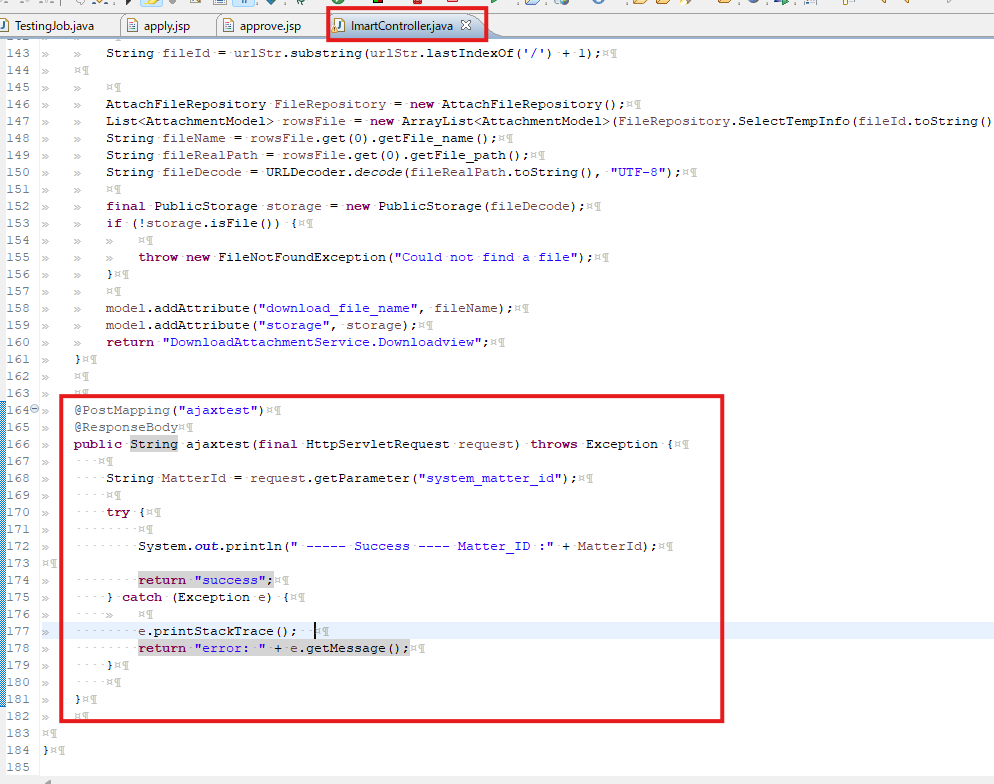
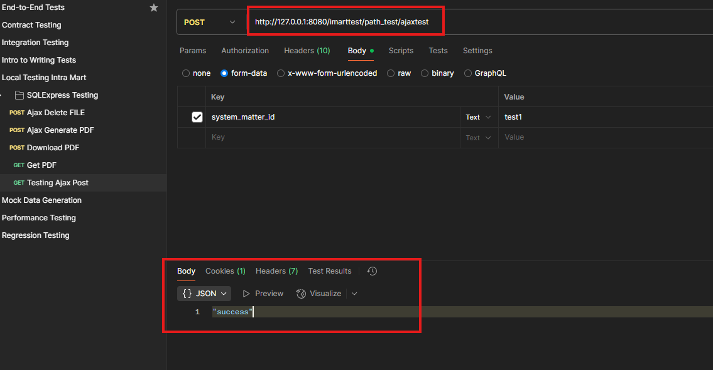
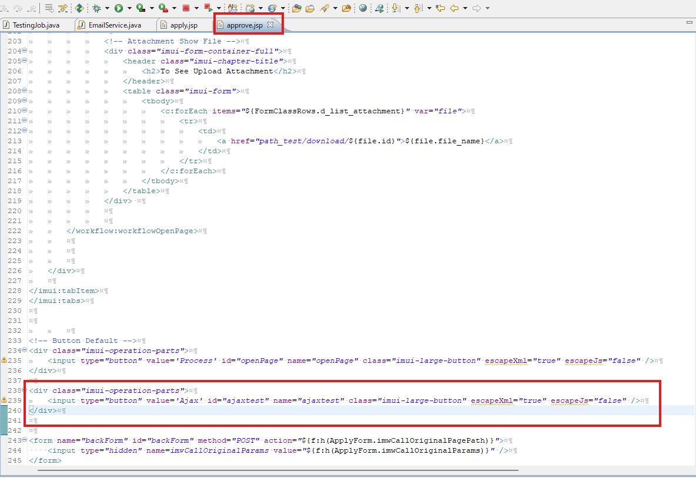
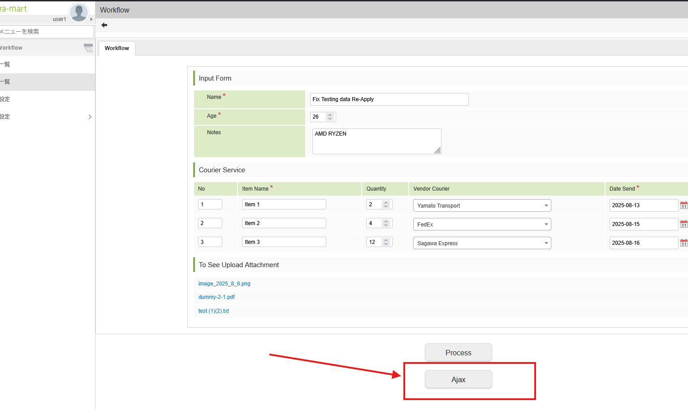
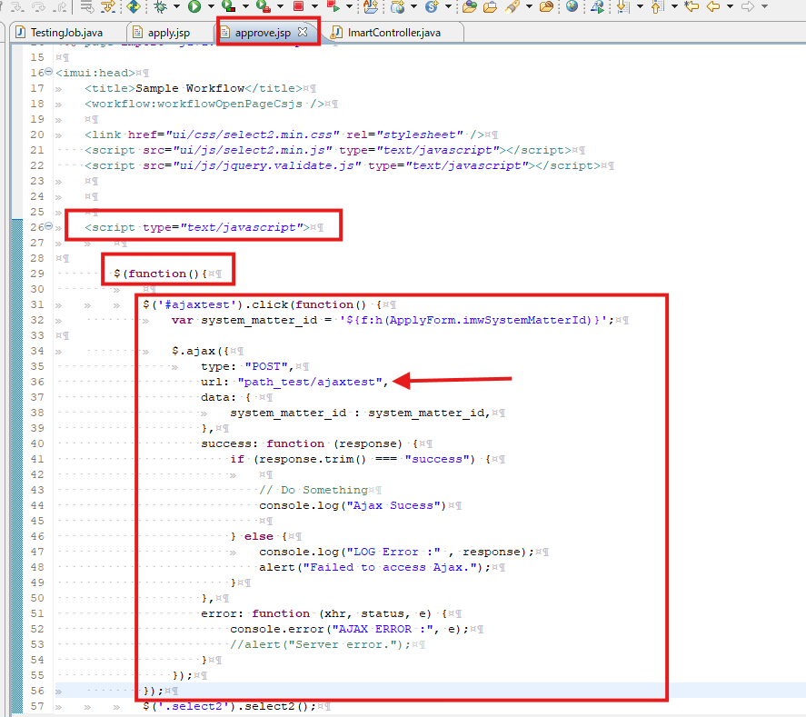
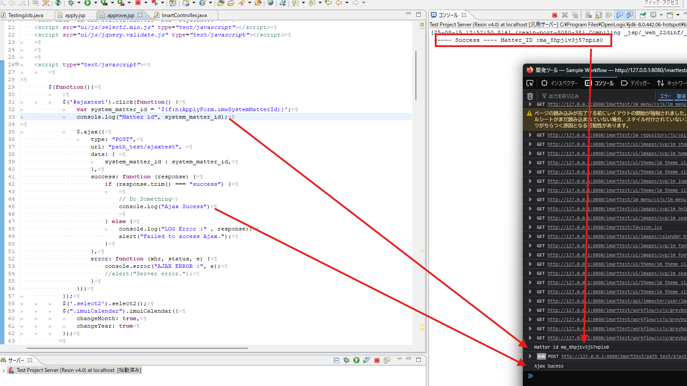

<h1 align="center">Intra Mart</h1>

⬅️
[Back 戻る](../README.md)


<h2 align="left">⭐Ajax Setup⭐</h2>


<h3 align="center">🚩Create Endpoint（Endpoint作成）🚩</h3>

<p align="left">
  
</p>


> **Sample Code Controller** 

> **Controllerソースコード** 

```sh
@PostMapping("ajaxtest")
@ResponseBody
public String ajaxtest(final HttpServletRequest request) throws Exception {
    
    String MatterId = request.getParameter("system_matter_id");
    
    try {
        
        System.out.println(" ----- Success ---- Matter_ID :" + MatterId);

        return "success";
    } catch (Exception e) {
        
        e.printStackTrace();  
        return "error: " + e.getMessage();
    }
    
}
```


> **Testing URL Endpoint in Postman (API Testing Tools)** 

> **APIテストツール（Postman）でのエンドポイント検証** 

<p align="left">
  
</p>

<h3 align="center">🚩Create Ajax Trigger（Ajaxトリガ作成）🚩</h3>

> **In this case, we're gonna use button to trigger Ajax** 

> **この場合、ボタンでAjaxを実行します。** 


<p align="left">
  
</p>

```sh
<div class="imui-operation-parts">
	<input type="button" value='Ajax' id="ajaxtest" name="ajaxtest" class="imui-large-button" escapeXml="true" escapeJs="false" />
</div>
```

<p align="left">
  
</p>

<p align="left">
  
</p>


> **Sample Code JavaScript** 

> **JavaScriptソースコード** 

```sh
$('#ajaxtest').click(function() {
    var system_matter_id = '${f:h(ApplyForm.imwSystemMatterId)}';
    console.log("Matter id", system_matter_id);

    $.ajax({
        type: "POST",
        url: "path_test/ajaxtest", 
        data: { 
            system_matter_id : system_matter_id,
        },
        success: function (response) {
            if (response.trim() === "success") {
                
                // Do Something
                console.log("Ajax Sucess")
                
            } else {
                console.log("LOG Error :" , response);
                alert("Failed to access Ajax.");
            }
        },
        error: function (xhr, status, e) {
            console.error("AJAX ERROR :", e);
            //alert("Server error.");
        }
    });
});
```

<p align="left">
  
</p>

⬅️
[Back 戻る](../README.md)
