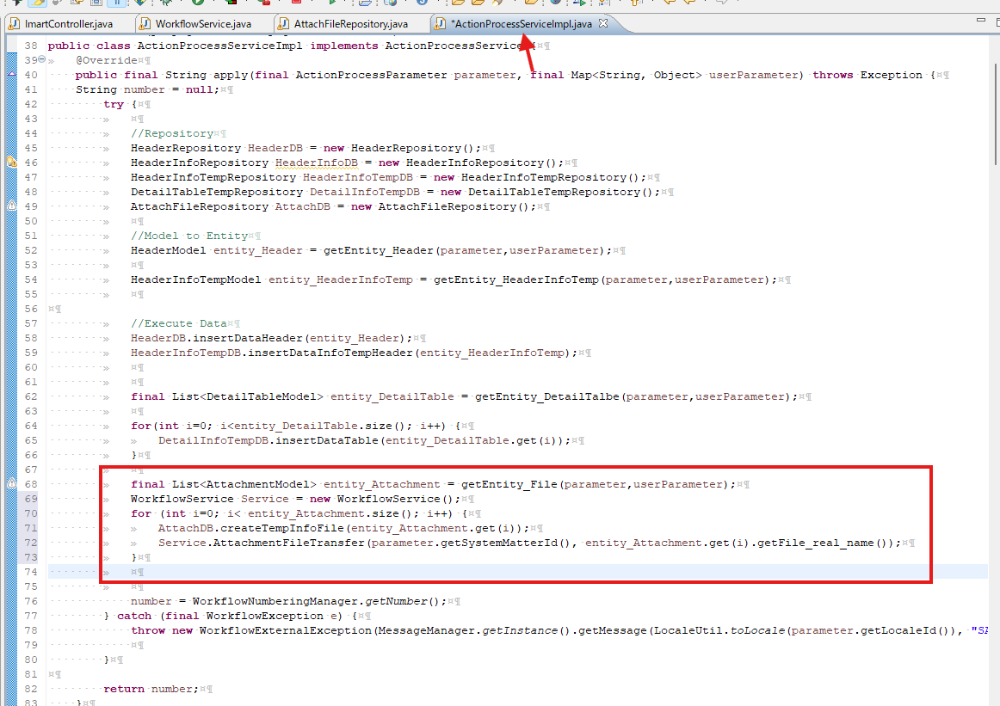

<h1 align="center">Intra Mart</h1>

⬅️
[Back 戻る](../README.md)


<h2 align="left">⭐Attachment Setup⭐</h2>

##### Example Attachment Design

<p align="center">
  
</p>

<p align="center">
  
</p>

Please follow the steps below (以下の手順に従ってください).

<h4 align="left">📖 Apply Action Process （申請処理）</h4>
Create Table　⇒　Create Model ⇒ Create Repository ⇒ Create Service Action 

テーブル作成 ⇒ モデル作成 ⇒ リポジトリ作成 ⇒ サービスアクション作成

<h4 align="left">📖 Process Data　（データ処理）</h4>
Get Data ⇒　Show data

データ取得 ⇒ データ表示

<h4 align="left">📖 Matter End Process　（案件終了処理）</h4>

Create Service MatterEnd ⇒ Update Database

案件終了サービス作成 ⇒ データベース更新

<h1 align="center">⏭️ Details (目次) ⏭️</h1>

    
1. [Apply Action Process](#apply-action-process)
    - [Create Database](#create-database)
    - [Create Model](#create-model)
    - [Create Repository](#create-repository)
        - [Full Code Repository](#full-code-repository)
    - [Edit Screen Apply](#edit-screen-apply)
        - [Attachment Source Code](#attachment-sourcecode)
        - [Attachment JS Function Scode](#function-sourcecode)
        - [Hidden Attachment Scode](#hidden-attachment-scode)
    - [Apply Service](#create-apply-service)
        - [File Transfer Scode](#file-transfer)
        - [Get Data Info Scode](#get-info-data-scode)
        - [Apply Testing](#apply-testing)

2. [Process Data](#process-data)
    - [Edit WorkflowService](#edit-workflowservice)
    - [Show Attachment Source Code](#show-attachment)
    - [Create Download Service](#create-download-service)
        - [Download Controller Scode](#download-controller)
        - [Download Service Scode](#download-function-service)
 
3. [Matter End Process](#matter-end)


<h3 align="center">🚩Apply Action Process （申請処理）🚩</h3>

### Apply Action Process

##### Create Database

> **Open PostgreSQL to create table in database that already created** 

> **PostgreSQLでの作成されたDBを開き、テーブルを作成** 


<p align="left">
  
</p>


<p align="left">
  
</p>


#### Create Model


<p align="left">
  
</p>


<p align="left">
  
</p>

#### Create Repository


<p align="left">
  
</p>


<p align="left">
  
</p>


<p align="left">
  
</p>


<p align="left">
  
</p>


<p align="left">
  
</p>


##### Full Code Repository
```sh

    private String tableName = "wf_attach_file";
	private String tableTempName = "wf_attach_file_temp";
	private String columnTable = "id,"
			+ "system_matter_id,"
			+ "user_data_id,"
			+ "file_name,"
			+ "file_path,"
			+ "file_real_name,"
			+ "file_type,"
			+ "created_at,"
	        + "updated_at";
	
	
	//Insert
	public void createTempInfoFile(AttachmentModel tempData) throws Exception {
		SQLManager sqlManager = new SQLManager();
		ColumnValues columnValues = setTempInfoFile(tempData, "create");
		sqlManager.insert(tableTempName, columnValues);
	}
	//Select
	public Collection<AttachmentModel> SelectTempInfo (String filterValue, String condition) throws Exception {
		SQLManager sqlMngr = new SQLManager();
		String sql = "SELECT * FROM " + tableTempName + " WHERE "
				+ condition + " = ?";
		Collection<Object> parameters = new ArrayList<Object>();
		if (condition.equals("id")) {
			parameters.add(Integer.parseInt(filterValue));
		}else {
			parameters.add(filterValue);
		}
		Collection<AttachmentModel> result = sqlMngr.select(AttachmentModel.class, sql, parameters);
		return result;
	}
	//Update
	public void updateTempFile (AttachmentModel tempData, String filterValue, String condition) throws Exception {
		SQLManager sqlManager = new SQLManager();
		ColumnValues columnValues = new ColumnValues();
		SearchCondition search = new SearchCondition();
		search.addCondition(condition, filterValue);
		columnValues = setTempInfoFile(tempData, "update");
		sqlManager.update(tableTempName, columnValues, search);
	}
	//Delete
	public void deleteTempInfoFile (String filterValue, String condition) throws Exception {
		SQLManager sqlManager = new SQLManager();
		SearchCondition searchCondition = new SearchCondition();
		searchCondition.addCondition(condition, filterValue);
		sqlManager.delete(tableTempName, searchCondition);
	}
	
	//Move data from Attach Temp Table to Attach Table
	public void MoveInfoFile (String systemMatterId) throws Exception {
		SQLManager sqlManager = new SQLManager();
		String sql = "INSERT INTO " + tableName + " (" + columnTable + ") SELECT "
	            + "id, system_matter_id, user_data_id, file_name, file_path, "
	            + "file_real_name, file_type, CURRENT_TIMESTAMP, CURRENT_TIMESTAMP "
	            + "FROM " + tableTempName + " WHERE system_matter_id = ?";
		Collection<Object> parameters = new ArrayList<Object>();
		parameters.add(systemMatterId);
		sqlManager.insert(sql, parameters);
	}
	
	
	private ColumnValues setTempInfoFile(AttachmentModel tempData, String Condition) throws Exception{
		ColumnValues result = new ColumnValues();
		
		LocalDateTime now = LocalDateTime.now();
		Timestamp timestamp = Timestamp.valueOf(now);
		
		if (Condition.equals("create")) {
			result.add("system_matter_id", tempData.getSystem_matter_id());
			result.add("user_data_id", tempData.getUser_data_id());
			result.add("file_name", tempData.getFile_name());
			result.add("file_path", tempData.getFile_path());
			result.add("file_real_name", tempData.getFile_real_name());
			result.add("file_type", tempData.getFile_type());
			result.add("created_at",timestamp);
			result.add("updated_at",timestamp);
		}else if (Condition.equals("update")) {
			result.add("system_matter_id", tempData.getSystem_matter_id());
			result.add("user_data_id", tempData.getUser_data_id());
			result.add("file_name", tempData.getFile_name());
			result.add("file_path", tempData.getFile_path());
			result.add("file_real_name", tempData.getFile_real_name());
			result.add("file_type", tempData.getFile_type());
			result.add("updated_at",timestamp);
		}
		
		
		return result;
	}

```


#### Edit Screen Apply


<p align="left">
  
</p>


##### Attachment SourceCode

```sh

<div class="imui-form-container-full">
    <header class="imui-chapter-title">
        
        <h2>
        Attachment
        </h2>
        
    </header>
    <table class="imui-form">
        <tbody>
            <tr>
                <th width="250"><label style="font-weight:Bold">Document Upload File</label></th>
                <td>
                    <imui:fileUpload
                            enableDelete="true"
                            uniqueFileName="true"
                            storeTo="file_attachment/"
                            onSuccess="callbackSuccess"
                            onError="callbackError"
                            onRemove="callbackRemove"
                    />
                </td>
            </tr>
        </tbody>
    </table>
</div>

```

<p align="left">
  
</p>

<p align="left">
  
</p>

<p align="left">
  
</p>

##### Function SourceCode

```sh

function callbackSuccess(e, data) {
    var file = data.files[0];
    var fileName = file.name;
    var fileSize = file.size;
    var fileType = file.type;

    //受信した情報
    var receiveFile = data.result[0];
    var receiveFileName = receiveFile.name;
    var receivePhysicalFileName = receiveFile.physicalName;
    var receiveFileSize = receiveFile.size;

    var fileExtension = receiveFileName.split('.').pop().toLowerCase();
    
    $(".file_attachment").prepend("<div class='" + receivePhysicalFileName + "'>"
        + "<input type='hidden' id='f_upload_file_id' name='f_upload_file_id'>"
        + "<input type='hidden' value='" + receiveFileName + "' id='f_upload_file_name' name='f_upload_file_name'>"
        + "<input type='hidden' value='" + receivePhysicalFileName + "' id='f_upload_file_real_name' name='f_upload_file_real_name'>"
        + "<input type='hidden' value='" + fileExtension + "' id='f_upload_file_type' name='f_upload_file_type'>"
        + "</div>");
}
function callbackRemove(e, data) {
    var file = data.response[0];
    var fileName = file.name;
    $("." + fileName).remove();
}
function callbackError(e, data) {
    var file = data.files[0];
    var fileName = file.name;
    var fileSize = file.size;
    var fileType = file.type;
    
}

```

> **(Optional)You can delete the For Each loop code for now — it will only be needed when we develop the Re-Apply System** 

> **(任意)For Eachループのコードは今は削除して大丈夫です。再申請システムを開発する時に必要になります。** 

<p align="left">
  
</p>


##### Hidden Attachment Scode

```sh
<!-- Hidden Input Attachment -->
<div class="file_attachment">
    <c:forEach items="${FormClassRows.d_list_attachment}" var="attachment">
        <div class="${attachment.file_real_name}">
            <input
                    type='hidden'
                    value='${attachment.id}'
                    id='f_upload_file_id'
                    name='f_upload_file_id'
            >
            <input
                    type='hidden'
                    value="${attachment.file_name}"
                    id='f_upload_file_name'
                    name='f_upload_file_name'
            >
            <input
                    type='hidden'
                    value="${attachment.file_real_name}"
                    id='f_upload_file_real_name'
                    name='f_upload_file_real_name'
            >
            <input
                    type='hidden'
                    value="${attachment.file_type}" 
                    id="f_upload_file_type"
                    name="f_upload_file_type"
            >
        </div>
    </c:forEach>
</div>	

```


#### Create Apply Service


<p align="left">
  
</p>


##### File Transfer

```sh

public final Boolean AttachmentFileTransfer(String systemMatterId, String file_real_name) {
    PublicStorage createDir = new PublicStorage("sample_workflow/" + systemMatterId + "/file_attachment");
    PublicStorage createFile = new PublicStorage(
            "sample_workflow/" + systemMatterId + "/file_attachment/" + file_real_name);
    SessionScopeStorage getOriginalFile = new SessionScopeStorage("file_attachment/" + file_real_name);
    try {
        
        createDir.makeDirectories();
    } catch (IOException e) {
        e.printStackTrace();
    }
    try {
        
        if (!createFile.isFile()) {
            
            createFile.save(org.apache.commons.io.IOUtils.toByteArray(getOriginalFile.open()));
            
        } else {
            
        }
    } catch (Exception e) {
        e.printStackTrace();
    }
    return true;
}

```


<p align="left">
  
</p>

<p align="left">
  
</p>


##### Get Info Data Scode

```sh

private List<AttachmentModel> getEntity_File(ActionProcessParameter parameter, Map<String, Object> userParameter) {
		List<AttachmentModel> result = new ArrayList<AttachmentModel>();
		
		try {

			//New Code
			List<String> attachmentId = normalizeToList(userParameter.get("f_upload_file_id"));
			List<String> attachmentFileName = normalizeToList(userParameter.get("f_upload_file_name"));
			List<String> attachmentRealName = normalizeToList(userParameter.get("f_upload_file_real_name"));
			List<String> attachmentFileType = normalizeToList(userParameter.get("f_upload_file_type"));
			
			for (int i=0 ; i<attachmentId.size();i++) {
				AttachmentModel entity = new AttachmentModel();
				entity.setSystem_matter_id(parameter.getSystemMatterId());
				entity.setUser_data_id(parameter.getUserDataId());

				entity.setFile_name(getEntityListString(attachmentFileName, i));
				entity.setFile_real_name(getEntityListString(attachmentRealName, i));
				entity.setFile_path("sample_workflow/" + parameter.getSystemMatterId() + "/file_attachment/" + entity.getFile_real_name());
				entity.setFile_type(getEntityListString(attachmentFileType, i));
				
				if(!entity.getFile_name().equals("") && !entity.getFile_real_name().equals("")) {
					if(!entity.getFile_name().equals("-") && !entity.getFile_real_name().equals("-")) {
						result.add(entity);
					}
				}
			}
		}catch (Exception e){
			
			System.out.println("Error Get Entity File");
			
		}
		
		return result;
	}
	
	
	@SuppressWarnings("unchecked")
    private List<String> normalizeToList(Object param) {
        if (param instanceof String) {
            return Collections.singletonList((String) param);
        } else if (param instanceof List) {
            return (List<String>) param;
        } else {
            return new ArrayList<>(); 
        }
    }

```

<p align="left">
  
</p>

###### Apply Testing

<p align="left">
  
</p>

<p align="left">
  
</p>

<p align="left">
  
</p>

<p align="left">
  
</p>


<h3 align="center">🚩🚩Process(Get Data) (処理プロセス)🚩🚩</h3>

### Process Data

⬅️
[Back to README 戻る](../README.md)


##### Edit Workflowservice


<p align="left">
  
</p>

<p align="left">
  
</p>

<p align="left">
  
</p>


##### Show Attachment

```sh

<!-- Attachment Show File -->
<div class="imui-form-container-full">
    <header class="imui-chapter-title">
        <h2>To See Upload Attachment</h2>
    </header>
    <table class="imui-form">
        <tbody>
            <c:forEach items="${FormClassRows.d_list_attachment}" var="file">
                <tr>
                    <td>
                        <a href="imarttest/download/${file.id}">${file.file_name}</a>
                    </td>
                </tr>
            </c:forEach>
        </tbody>
    </table>
</div> 

```


<p align="left">
  
</p>


##### Create Download Service


<p align="left">
  
</p>


##### Download Controller

```sh

@RequestMapping(value = "download/**")
public String download(final Model model, HttpServletRequest request) throws Exception {
    

    String urlStr = (String) request.getAttribute(HandlerMapping.PATH_WITHIN_HANDLER_MAPPING_ATTRIBUTE);
    
    String fileId = urlStr.substring(urlStr.lastIndexOf('/') + 1);

    
    AttachFileRepository FileRepository = new AttachFileRepository();
    List<AttachmentModel> rowsFile = new ArrayList<AttachmentModel>(FileRepository.SelectTempInfo(fileId.toString(), "id"));
    String fileName = rowsFile.get(0).getFile_name();
    String fileRealPath = rowsFile.get(0).getFile_path();
    String fileDecode = URLDecoder.decode(fileRealPath.toString(), "UTF-8");
    
    final PublicStorage storage = new PublicStorage(fileDecode);
    if (!storage.isFile()) {
        
        throw new FileNotFoundException("Could not find a file");
    }
    
    model.addAttribute("download_file_name", fileName);
    model.addAttribute("storage", storage);
    return "DownloadAttachmentService.Downloadview";
}


```


<p align="left">
  
</p>


<p align="left">
  
</p>


##### Download Function Service

```sh


import java.io.IOException;
import java.io.InputStream;
import java.io.UnsupportedEncodingException;
import java.util.Map;

import javax.servlet.http.HttpServletRequest;
import javax.servlet.http.HttpServletResponse;

import org.springframework.stereotype.Component;
import org.terasoluna.gfw.common.exception.SystemException;
import org.terasoluna.gfw.web.download.AbstractFileDownloadView;

import jp.co.intra_mart.foundation.http.ResponseUtil;
import jp.co.intra_mart.foundation.service.client.file.Storage;

@Component("DownloadAttachmentService.Downloadview")
public class DownloadAttachmentService extends AbstractFileDownloadView {
	
	@Override
	protected void addResponseHeader(Map<String, Object> model, HttpServletRequest request, HttpServletResponse response) {
		final String disposition;
		try {
			
			final String fileName = model.get("download_file_name").toString();
			disposition = ResponseUtil.encodeFileName(request, "UTF-8", fileName);
		} catch (UnsupportedEncodingException e) {
			e.printStackTrace();
			throw new SystemException ("download view error code", e);
		}
		response.setHeader("Content-Disposition", "attachment;" + disposition);
		response.setContentType("application/force-download");
	}

	@Override
	protected InputStream getInputStream(Map<String, Object> model, HttpServletRequest request) throws IOException {
		final Storage<?> storage = (Storage<?>)model.get("storage");
		return storage.open();
	}

}


```

<p align="left">
  
</p>

<p align="left">
  
</p>

<p align="left">
  
</p>

<p align="left">
  
</p>


<h3 align="center">🚩🚩MatterEndProcess (案件終了)🚩🚩</h3>


⬅️
[Back to README 戻る](../README.md)


##### Matter End


<p align="left">
  
</p>

<p align="left">
  
</p>

<p align="left">
  
</p>

<p align="left">
  
</p>


⬅️
[Back to README 戻る](../README.md)
