<h1 align="center">Intra Mart</h1>

⬅️
[Back 戻る](../README.md)


<h2 align="left">⭐Jobnet Setup⭐</h2>


<h1 align="center">⏭️ Details (目次) ⏭️</h1>

    
1. [Create Jobnet](#crete-job-system)
    - [Create File Source Code](#source-code)
        - [Sample Source Code](#jobnet-source-code)
    - [Setup Job IM System](#setup-job-im-system)
    - [Setup Jobnet IM System](#setup-jobnet-im-system)

   


<h3 align="center">🚩Create Jobnet（ジョブネット作成）🚩</h3>

### Create Job System

#### Source Code 
<p align="left">
  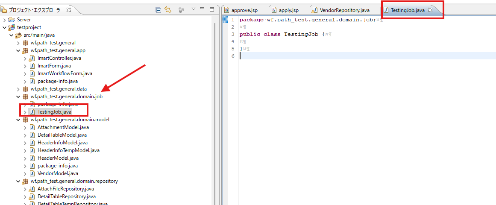
</p>


##### Jobnet Source Code

```sh

import java.sql.Timestamp;
import java.time.LocalDate;
import java.time.LocalDateTime;
import java.time.format.DateTimeFormatter;
import java.util.ArrayList;
import java.util.Collection;
import java.util.List;

import jp.co.intra_mart.foundation.job_scheduler.Job;
import jp.co.intra_mart.foundation.job_scheduler.JobResult;
import jp.co.intra_mart.foundation.job_scheduler.exception.JobExecuteException;
import jp.co.intra_mart.foundation.workflow.exception.WorkflowException;
import jp.co.intra_mart.framework.extension.spring.context.ApplicationContextProvider;


public class TestingJob implements Job {
	
	public JobResult execute() throws JobExecuteException {
			
		try {
			
			System.out.println("-------- RUNNING JOB SUCCESS  -----------");
			


        } catch (Exception e) {
            throw new JobExecuteException("Error during job execution.", e);
        }
		return JobResult.success("success");
    }

}

```


<p align="left">
  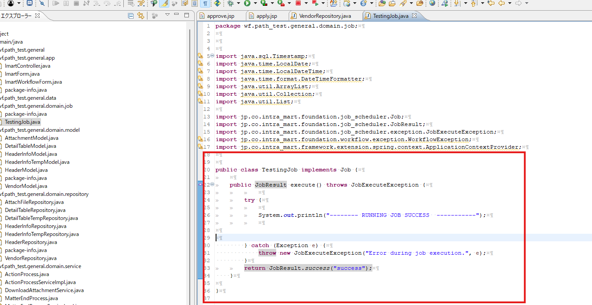
</p>


#### Setup Job IM System 

<p align="left">
  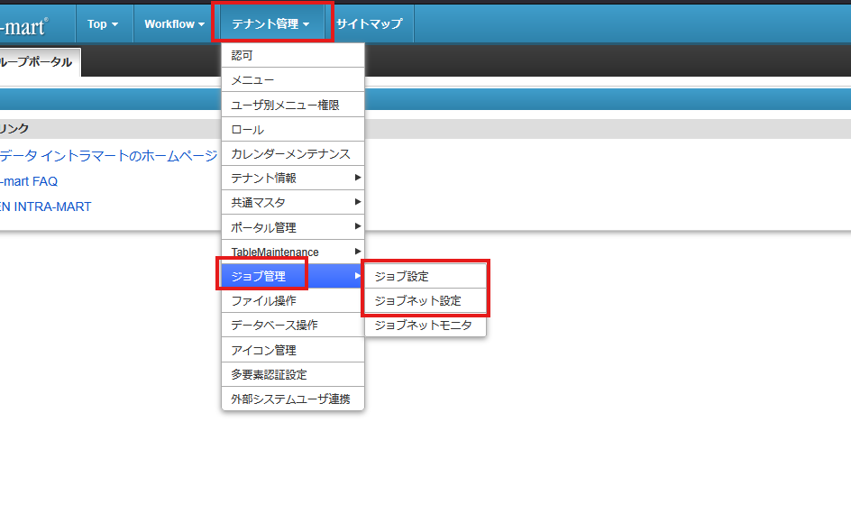
</p>


<p align="left">
  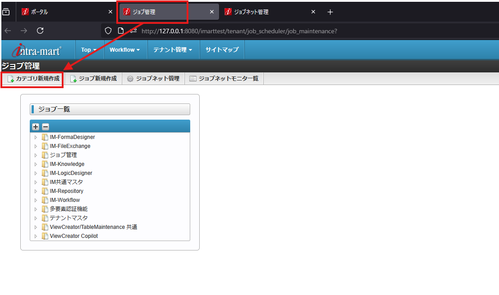
</p>

<p align="left">
  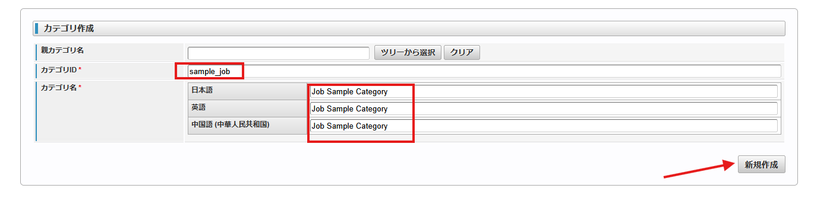
</p>

<p align="left">
  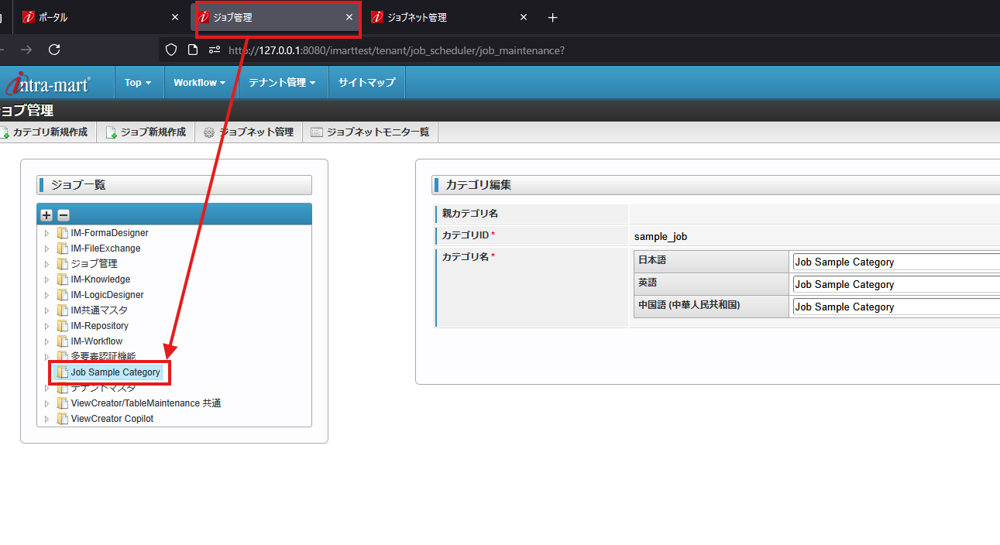
</p>


<p align="left">
  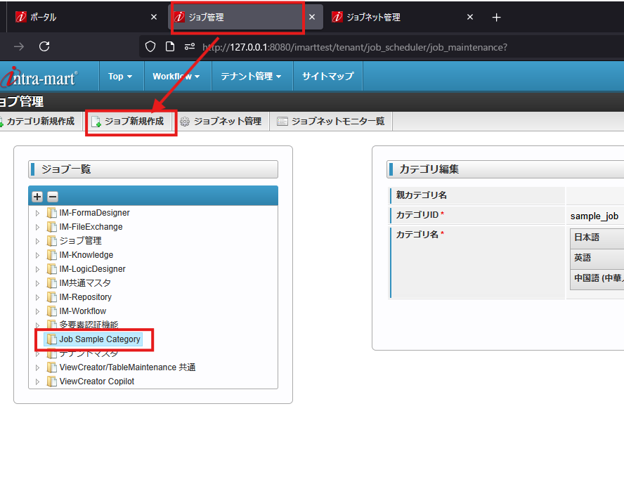
</p>


> **Ensure the path url are same with the package and file that you created** 

> **作成されたソースコードファイルを確認し、パッケージのパースの確認が必要です** 

<p align="left">
  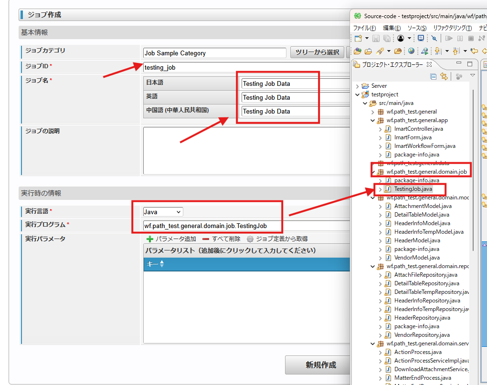
</p>

<p align="left">
  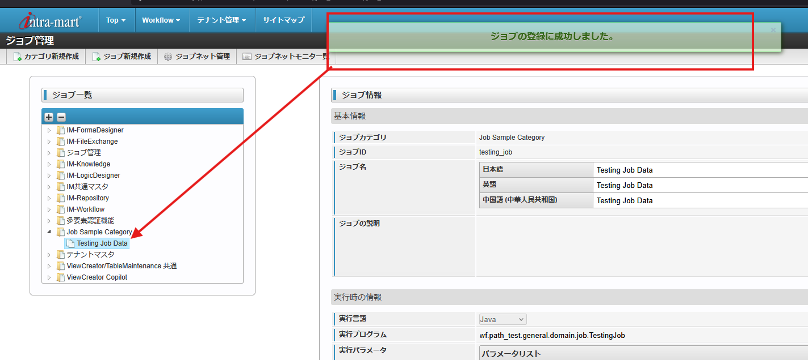
</p>

#### Setup Jobnet IM System 

<p align="left">
  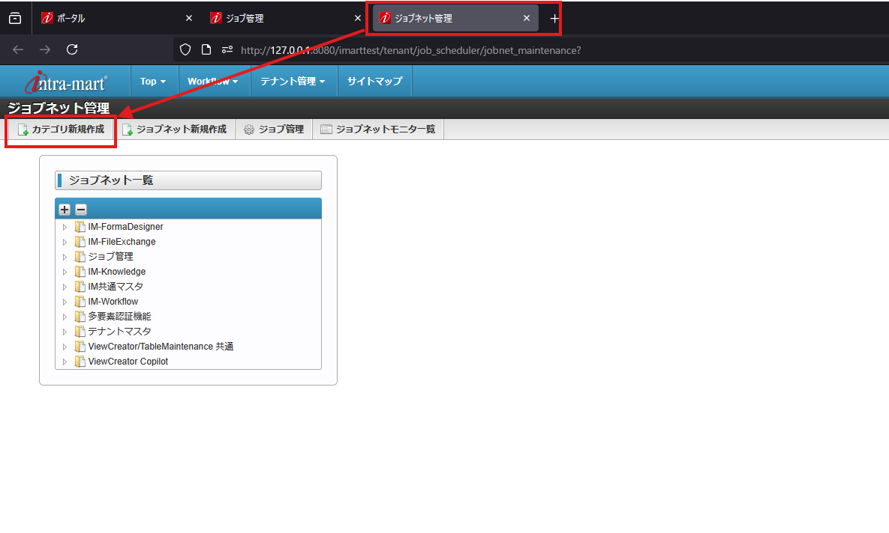
</p>

<p align="left">
  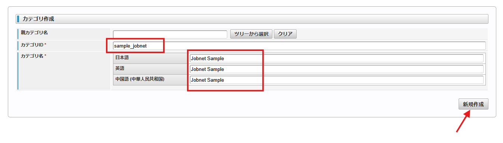
</p>

<p align="left">
  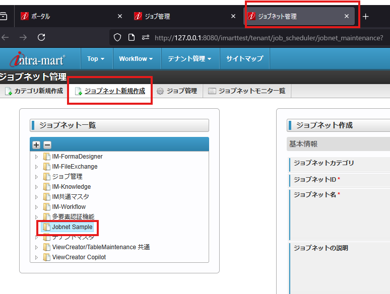
</p>

<p align="left">
  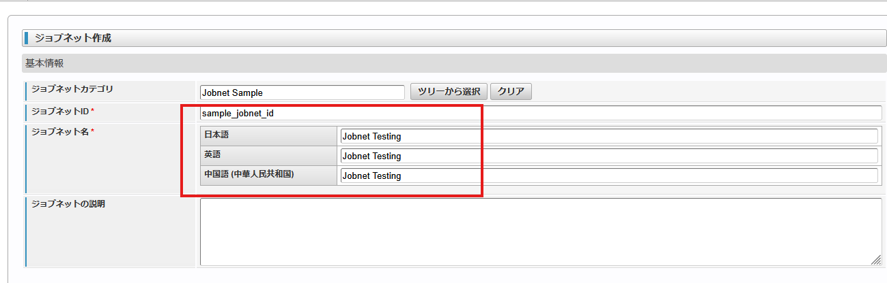
</p>


<p align="left">
  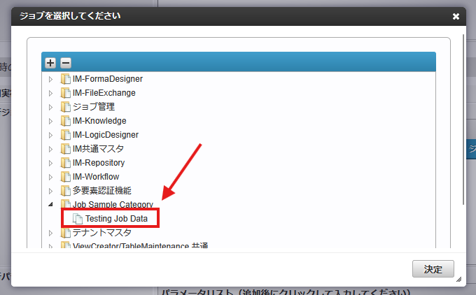
</p>

<p align="left">
  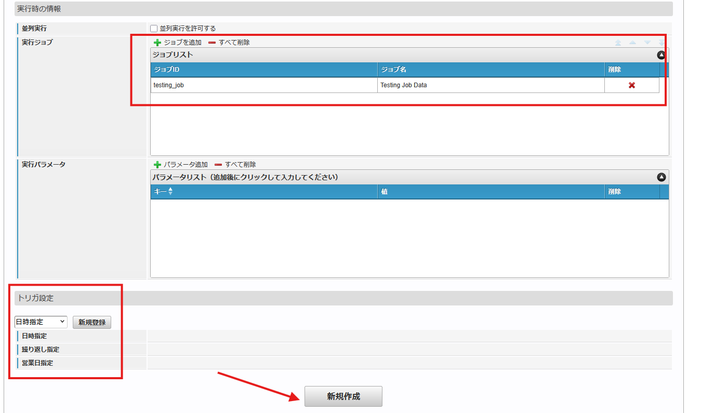
</p>

<p align="left">
  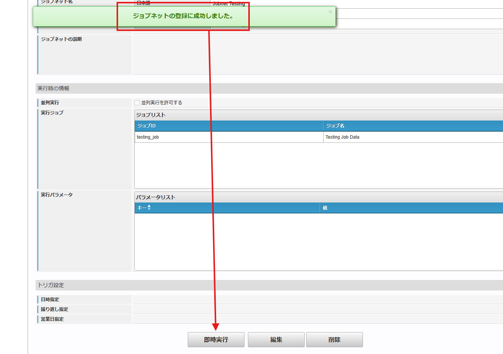
</p>

<p align="left">
  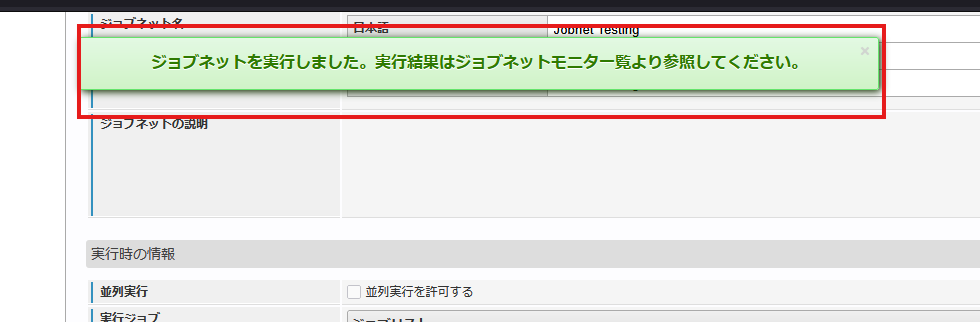
</p>


> **You can create your own code or automation system that needed** 

> **ジョブネットのシステムは希望システムの通りにソースコードを作成してください** 

<p align="left">
  
</p>

⬅️
[Back to README 戻る](../README.md)

