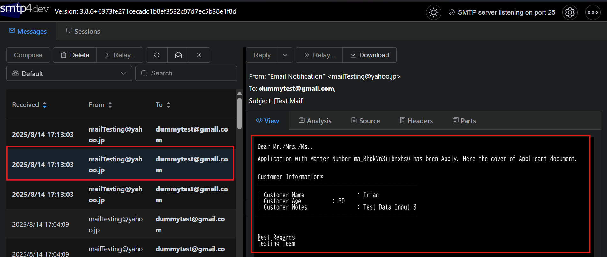

<h1 align="center">Intra Mart</h1>

⬅️
[Back 戻る](../README.md)


<h2 align="left">⭐Mail Setup⭐</h2>

> **Before create the Mail Function, Ensure you already have SMTP4Dev installed** 

> **開発する為、SMTP4Devアプリが必要** 


##### Example Mail Flow Design

<p align="center">
  
</p>


<p align="center">
  
</p>


<h1 align="center">⏭️ Details (目次) ⏭️</h1>

    
1. [Modify Database](#edit-action-process-service-impl)
2. [Modify Jobnet Source Code](#modify-source-code)
    - [Send Mail Function Source Code](#send-mail-function-service)
3. [Test Mail Function](#testing-area)


<h3 align="center">🚩Modify Database（再申請機能作成）🚩</h3>

##### Edit Action Process Service Impl

<p align="left">
  
</p>

<p align="left">
  
</p>

<p align="left">
  
</p>

> **Update Source Code Apply Action Process** 

> **Apply Action Processソースコードの編集が必要** 

<p align="left">
  
</p>

> **Update Source Code Matter End Process** 

> **MaterEndProcessソースコードの編集が必要** 

<p align="left">
  
</p>


<h3 align="center">🚩Modify Jobnet Source Code（再申請機能作成）🚩</h3>

#### Modify Source Code

<p align="left">
  
</p>

<p align="left">
  
</p>

<p align="left">
  
</p>

<p align="left">
  
</p>

<p align="left">
  
</p>

<p align="left">
  
</p>


##### Send Mail Function Service

> **Send Mail Source Code** 

> **メール送信ソースコード** 

```sh
public void send_email(String matterId, String mail, ImartForm FormClassRows) throws Exception {
		
		
		
    //set Data
    String matterID = FormClassRows.getF_system_matter_id();
    String name = FormClassRows.getF_name();
    String age = FormClassRows.getF_age();
    String note = FormClassRows.getF_note();
    
    //Set Mail
    StandardMail create_mail = new StandardMail();
    create_mail.setFrom("mailTesting@yahoo.jp", "Email Notification");
    create_mail.setSubject(" [Test Mail]");
    create_mail.setText("Dear Mr./Mrs./Ms.,\r\n" + 
            "\r\n" + 
            "Application with Matter Number " + matterID + " has been Apply. Here the cover of Applicant document. \r\n" +
            "\r\n" + 
            "\r\n" +
            "Customer Information*  \r\n" + 
            "___________________________________________________ \r\n\r\n" + 
            "| Customer Name 		: " + name + "\r\n" + 
            "| Customer Age 		: " +  age + "\r\n" + 
            "| Customer Notes 		: " +  note + "\r\n" + 
            "___________________________________________________ \r\n\r\n" +
            "\r\n" + 
            "\r\n" +
            "Best Regards,\r\n" + 
            "Testing Team\r\n");
    create_mail.addTo(mail);
    
    //Execute Mail
    try {
        JavaMailSender sender = new JavaMailSender(create_mail);
        sender.send();
        //Update mail_status in HeaderDB
        HeaderRepository HeaderDB = new HeaderRepository();
        HeaderModel rows_header = HeaderDB.selectDataHeader(matterId, "system_matter_id").iterator().next();
        rows_header.setMail_status("2");
        HeaderDB.updateDataHeader(rows_header);
    } catch (MailSenderException var30) {
        //Update mail_status in HeaderDB
        HeaderRepository HeaderDB = new HeaderRepository();
        HeaderModel rows_header = HeaderDB.selectDataHeader(matterId, "system_matter_id").iterator().next();
        rows_header.setMail_status("99");
        HeaderDB.updateDataHeader(rows_header);
        
        var30.printStackTrace();
        throw new MailSenderException ("Error in sendEmailWithAttachment()", var30);
    }
}
```

⬅️
[Back 戻る](../README.md)


<h3 align="center">🚩Testing Mail Function（再申請機能作成）🚩</h3>

#### Testing Area

> **To Test the Mail Function, Ensure you already have SMTP4Dev installed** 

> **テストする為、SMTP4Devアプリが必要** 

<p align="left">
  
</p>

<p align="left">
  
</p>

<p align="left">
  
</p>

<p align="left">
  
</p>