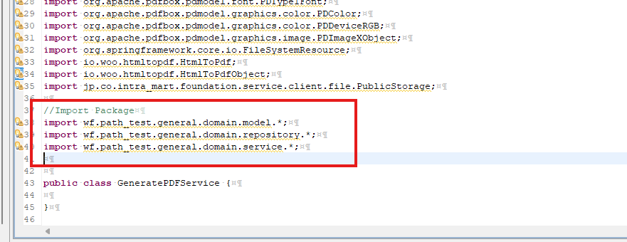
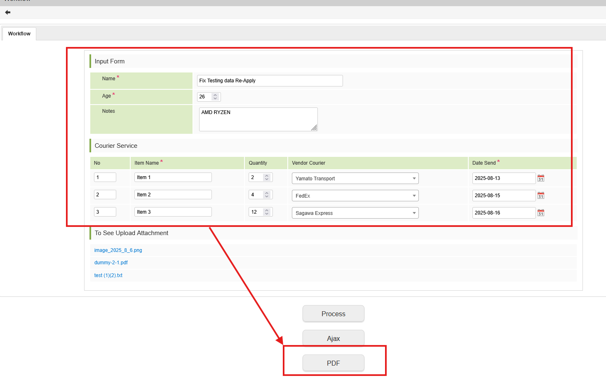

<h1 align="center">Intra Mart</h1>

⬅️
[Back 戻る](../README.md)


<h2 align="left">⭐PDF Setup⭐</h2>


Please follow the steps below (以下の手順に従ってください).


<h1 align="center">⏭️ Details (目次) ⏭️</h1>

    
1. [File Requirement](#prepare-file-requirement)
2. [Create PDF Generate Trigger](#create-pdf-generate)
    - [Import Module Service](#import-module)
    - [Full Code Generate PDF Service](#full-code-pdf-generate-service)
    - [Generate PDF Controller Scode](#generate-pdf-controller)
    - [Download PDF Controller Scode](#pdf-download-controller)
    - [JSP JavaScript Scode](#jsp-javascript)
3. [Testing Function](#testing-area)


<h3 align="center">🚩File Requirement（必要なファイルを準備する）🚩</h3>

##### Prepare File Requirement

> **Required File, You can request the file to PIC** 

> **必要なファイルは担当者に聞いてください。** 


<p align="left">
  
</p>

<p align="left">
  
</p>

<p align="left">
  
</p>

<p align="left">
  
</p>

<p align="left">
  
</p>

<p align="left">
  
</p>

<p align="left">
  
</p>

<p align="left">
  
</p>

<h3 align="center">🚩PDF Trigger（PDFトリガ作成）🚩</h3>

##### Create PDF Generate


<p align="left">
  
</p>


<p align="left">
  
</p>

> **Create Generate PDF Service** 

<p align="left">
  
</p>

<p align="left">
  
</p>

<p align="left">
  
</p>


> **Import Source Code** 

> **インポートソースコード** 

##### Import module

```sh

import java.awt.Color;
import java.io.ByteArrayInputStream;
import java.io.ByteArrayOutputStream;
import java.io.InputStream;
import java.text.DecimalFormat;
import java.text.NumberFormat;
import java.text.SimpleDateFormat;
import java.time.LocalDateTime;
import java.time.format.DateTimeFormatter;
import java.util.ArrayList;
import java.util.Collection;
import java.util.Date;
import java.util.HashMap;
import java.util.List;
import java.util.Locale;
import java.util.Map;
import java.util.regex.Matcher;
import java.util.regex.Pattern;

import org.apache.commons.io.IOUtils;
import org.apache.pdfbox.pdmodel.PDDocument;
import org.apache.pdfbox.pdmodel.PDPage;
import org.apache.pdfbox.pdmodel.PDPageContentStream;
import org.apache.pdfbox.pdmodel.common.PDRectangle;
import org.apache.pdfbox.pdmodel.font.PDFont;
import org.apache.pdfbox.pdmodel.font.PDType1Font;
import org.apache.pdfbox.pdmodel.graphics.color.PDColor;
import org.apache.pdfbox.pdmodel.graphics.color.PDDeviceRGB;
import org.apache.pdfbox.pdmodel.graphics.image.PDImageXObject;
import org.springframework.core.io.FileSystemResource;
import io.woo.htmltopdf.HtmlToPdf;
import io.woo.htmltopdf.HtmlToPdfObject;
import jp.co.intra_mart.foundation.service.client.file.PublicStorage;

//Import Package
import wf.path_test.general.domain.model.*;
import wf.path_test.general.domain.repository.*;
import wf.path_test.general.domain.service.*;

```


<p align="left">
  
</p>

<p align="left">
  
</p>

<p align="left">
  
</p>

<p align="left">
  
</p>

<p align="left">
  
</p>


<p align="left">
  
</p>

#### Full Code PDF Generate Service


```sh

public class GeneratePDFService {
	
	public String check_null_string(String check_string) {
		if(check_string==null) {
			return "";
		}else {
			return check_string;
		}
	}
	
	
	public void createPDF(String systemMatterId) throws Exception{
		
		try {
			//Repository
			HeaderInfoTempRepository HeaderTempDB = new HeaderInfoTempRepository();
			DetailTableTempRepository DetailTempDB = new DetailTableTempRepository();
			
			//Get Data From DB
			Collection<HeaderInfoTempModel> rows_header = HeaderTempDB.selectDataInfoTempHeader(systemMatterId, "system_matter_id");
			HeaderInfoTempModel HeaderTempRows = rows_header.iterator().next();
			
			
			List<DetailTableModel> DetailData = new ArrayList<DetailTableModel>();
			//Try Fetch List Detail Data
			try {
				DetailData = new ArrayList<DetailTableModel>(DetailTempDB.selectDataTable(systemMatterId, "system_matter_id"));
			}catch(Exception e) {
				System.out.println("Error Fetching Data in Generate PDF");
			}
		
			// Create Header HTMl CSS
			String html = "<html><head>"
					+"<meta charset='UTF-8'>"
			 		+ "<style type='text/css'>"
					 
					+ "#table1 td {"
					+ "		font-family: MS PGothic; "
					+ "		font-size: 12pt;"
					+ "	}"
					
			 		
					+ "#table2 td {"
					+ "	  	border: 1px solid black;"
					+ "		font-family: MS PGothic; "
					+ "		padding: 5px;"
			 		+ "		font-size: 6pt;"
					+ "	}"				
		 			+ "</style>";
			 	
				html += "</head><body>";
				
				html += "<table border='0' id='table1' width='100%'>"
					    +   "<tr>"
					    +     "<td align='center' colspan='4' style='font-size:20px;'>Summary Data<br><br></td>"
					    +   "</tr>"
					    +   "<tr>"
					    +     "<td valign='top'><b>Name</b></td>"
					    +     "<td valign='top'><b>Age</b></td>"
					    +     "<td valign='top'><b>Notes</b></td>"
					    +   "</tr>"
					    +   "<tr>"
					    +     "<td valign='top'>" + HeaderTempRows.getName() + "</td>"
					    +     "<td valign='top'>" + HeaderTempRows.getAge() + "</td>"
					    +     "<td valign='top'>" + HeaderTempRows.getNote() + "</td>"
					    +   "</tr>"
					    + "</table>";
				
				html += "<table width='100%' id='table2' style='border-collapse: collapse;'>"
						+ 	"<tr>"
						+ 		"<td colspan='7' align='center' style='font-weight: BOLD;'>CONTENT</td>"
						+   "</tr>"
						+   "<tr>"
					    +     "<td align='center'><b>No</b></td>"
					    +     "<td align='center'><b>Item Name</b></td>"
					    +     "<td align='center'><b>Quantity</b></td>"
					    +     "<td align='center'><b>Vendor Courier</b></td>"
					    +     "<td align='center'><b>Date Send</b></td>"
					    +   "</tr>";

			for(int i=0; i< DetailData.size(); i++) {
				
				html += "<tr>"

					    +     "<td align='center'>" + check_null_string(DetailData.get(i).getSeq_number()) + "</td>"
					    +     "<td align='left'>" + check_null_string(DetailData.get(i).getItem_name()) + "</td>"
					    +     "<td align='left'>" + check_null_string(DetailData.get(i).getQuantity()) + "</td>"
					    +     "<td align='left'>" + check_null_string(DetailData.get(i).getVendor()) + "</td>"
					    +     "<td align='left'>" + check_null_string(DetailData.get(i).getSend_date()) + "</td>"
					    +"</tr>";
			}
			
			html += ""
				    + "</table>"
				    + "<br>";
			
			html +=  "<body><html>";
			
			InputStream success_pdf = HtmlToPdf.create()
	        	    .object(HtmlToPdfObject.forHtml(html))
	        	    .convert();

			try {
				// set folder and file path
				PublicStorage PDFFilePath = new PublicStorage("generate_pdf/sample.pdf");
				PublicStorage createNewDir = new PublicStorage("generate_pdf");
				
				
				try {
					createNewDir.makeDirectories();
				} catch (Exception e) {
					e.printStackTrace();
					throw new Exception ("error creating directory PDF Generate ", e);
				}
				
				PDFFilePath.save(IOUtils.toByteArray(success_pdf));
			}catch (Exception e) {
				
			}
			
		}catch(Exception e) {
			
		}
	}
	
	

}
```


#### Generate PDF Controller

<p align="left">
  
</p>


> **Generate PDF Source Code** 

> **PDF作成ソースコード** 

```sh

	@PostMapping("generatepdf")
	@ResponseBody
	public String generatepdf(final HttpServletRequest request) throws Exception {
	   
	    String MatterId = request.getParameter("system_matter_id");
	    
	    try {
	        GeneratePDFService pdfGenerate = new GeneratePDFService();
	        
	        pdfGenerate.createPDF(MatterId);
	        

	        return "success";
	    } catch (Exception e) {
	    	
	        e.printStackTrace();  
	        return "error: " + e.getMessage();
	    }
	    
	}

```


#### PDF Download Controller

<p align="left">
  
</p>


> **Download PDF Source Code** 

> **PDFダウンロードソースコード** 


> **For DownloadAttachmentService, you can check in Attachment Documentation Download** 

> **DownloadAttachmentServiceのソースコードは添付（Attachment）のドキュメントに書かれていたのでご覧ください。** 

```sh

	@RequestMapping(value = "downloadpdf/**")
	public String downloadpdf(final Model model, HttpServletRequest request) throws Exception {
		
		
		String urlStr = (String) request.getAttribute(HandlerMapping.PATH_WITHIN_HANDLER_MAPPING_ATTRIBUTE);
		String fileName = urlStr.substring(urlStr.lastIndexOf('/') + 1);

		//System.out.println("Data File Name : "+fileName );

		String file_decode = URLDecoder.decode("generate_pdf/" + fileName, "UTF-8");
		final PublicStorage storage = new PublicStorage(file_decode);
		if (!storage.isFile()) {
			
			throw new FileNotFoundException("Could not find a file");
		}
		
		model.addAttribute("download_file_name", fileName);
		model.addAttribute("storage", storage);
		
		return "DownloadAttachmentService.Downloadview";
	}

```

#### JSP JavaScript 

<p align="left">
  
</p>


> **JavaScript Source Code (using Ajax)** 

> **JavaScriptソースコード（Ajax使用）** 


```sh

	$('#pdfgenerate').click(function() {
    var system_matter_id = '${f:h(ApplyForm.imwSystemMatterId)}';
    $.ajax({
          type: "POST",
            url: "path_test/generatepdf", 
            data: { 
              system_matter_id : system_matter_id,
            },
            success: function (response) {
                if (response.trim() === "success") {
                  
                    // Do Something
                  window.location.href = "/imarttest/path_test/downloadpdf/sample.pdf";
                    
                } else {
                  console.log("LOG Error :" , response);
                    alert("Failed to Generate PDF");
                }
            },
            error: function (xhr, status, e) {
                console.error("AJAX ERROR :", e);
                //alert("Server error.");
            }
        });
  });

```

⬅️
[Back 戻る](../README.md)


<h3 align="center">🚩Testing PDF Generate Function（PDF作成機能テスト）🚩</h3>

#### Testing Area

<p align="left">
  
</p>

<p align="left">
  
</p>

⬅️
[Back 戻る](../README.md)