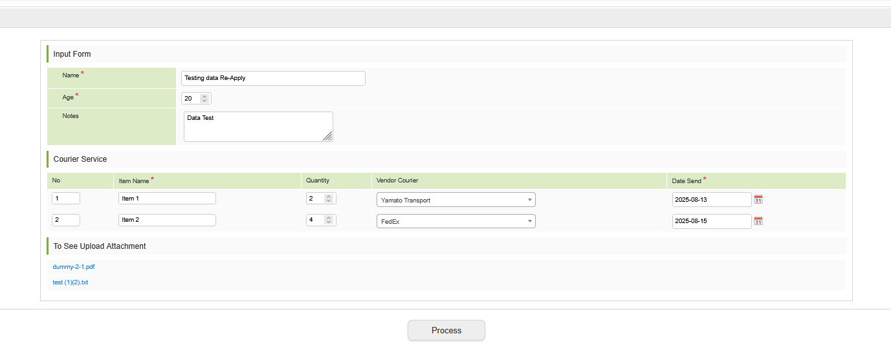
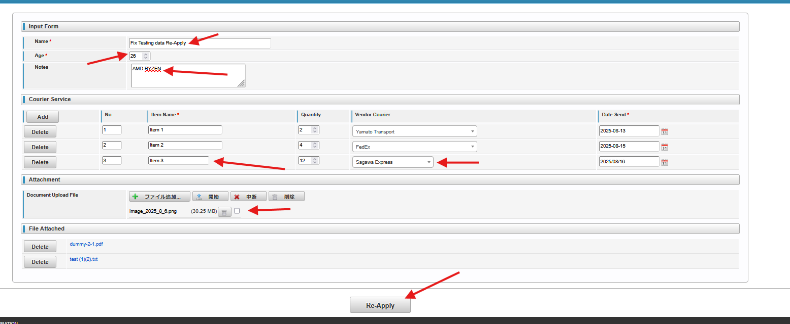

<h1 align="center">Intra Mart</h1>

⬅️
[Back 戻る](../README.md)


<h2 align="left">⭐Re-Apply （差戻し）Setup⭐</h2>


##### Example Re-Apply Flow Design

<p align="center">
  
</p>


<p align="center">
  
</p>


Please follow the steps below (以下の手順に従ってください).

<h4 align="left">📖 Re-Apply Action Process （ 再申請処理）</h4>
Edit Action Process Service Impl　⇒　Edit Repository ⇒ Edit Controller ⇒ Edit Apply.jsp ⇒ Testing Re-Apply

Action Process Service Impl編集 ⇒ Repository編集 ⇒　Controller 編集 ⇒ Edit編集


<h1 align="center">⏭️ Details (目次) ⏭️</h1>

    
1. [Re-Apply Action Process](#edit-action-process-service-impl)
    - [Update Repository Scode](#update-repo)
    - [Delete Repository Scode](#delete-repo)
    - [Edit Controller](#setup-controller)
    - [Edit Apply.jsp](#setup-screen)
      - [File Attached Scode](#file-attached)
      - [Delete Data Attachment](#delete-data-attachment)
        - [Delete Attachment Scode](#delete-scode)
2. [Testing Re-Apply](#testing-data)
3. [Error Fixing](#error-fixing)
    - [Fix Error Scode](#example-logic-condition-scode)


<h3 align="center">🚩Re-Apply Action Function（再申請機能作成）🚩</h3>

##### Edit Action Process Service Impl

<p align="left">
  
</p>

> **Define the Repository** 

> **Repository定義（追加）** 


<p align="left">
  
</p>

> **Execute Data** 

> **データ実行** 

<p align="left">
  
</p>

#### Update Repo

> **Update Data Repository** 

> **更新データ関数を追加** 


<p align="left">
  
</p>


<p align="left">
  
</p>

#### Delete Repo

> **Delete Data Repository** 

> **データ削除関数を追加** 


<p align="left">
  
</p>


<p align="left">
  
</p>


> **You can use created function to get Entity from the Apply Section** 

> **Apply関数から既存ソースコード使用できる** 

<p align="left">
  
</p>

<p align="left">
  
</p>


##### Setup Controller 


<p align="left">
  
</p>

#### Setup Screen

> **Add Value Command to the Input Field** 

> **Value(コマンド)追加が必要** 

<p align="left">
  
</p>


##### Detail Table

> **For data in detail table (Rows), You can copy source code from Approve.jsp** 

> **詳細なテーブル部分はApprove.JSPからコピペしてもOK** 


<p align="left">
  
</p>


> **Remove "readonly" part from the source code, so you can edit the input data** 

> **コピペした後、"readonly"の部分を削除が必要** 

<p align="left">
  
</p>


<p align="left">
  
</p>


<p align="left">
  
</p>


<p align="left">
  
</p>

##### File attached

> **File Attached Source Code** 

> **添付ファイルソースコード** 

```sh
<imart:decision case="3" value="${f:h(ApplyForm.imwPageType)}">
<div class="imui-form-container-full">
  <header class="imui-chapter-title">
    <h2>File Attached</h2>
  </header>
  <table class="imui-form file_attachment_list">
    <tbody>
      <c:forEach items="${FormClassRows.d_list_attachment}" var="file">
        <tr>
          <td width='100'>
            <input type='button' value='Delete' name="${item_file.file_real_name}" id='delete_file' class='imui-medium-button' />
          </td>
          <td>
            <a href="path_test/download/${file.id}">${file.file_name}</a>
          </td>
        </tr>
      </c:forEach>
    </tbody>
  </table>
</div>
</imart:decision>
```


#### Delete Data Attachment

> **添付ファイル削除機能**

<p align="left">
  
</p>

<p align="left">
  
</p>

###### Delete Scode

> **Source Code JavaScript** 

> **JavaScriptソースコード** 

```sh
//Delete File Attachment
$(".file_attachment_list").on("click", "#delete_file", function() {
$(this).closest("tr").remove();
var fileName = $(this).attr("name");
$("." + fileName).remove();
});
```

⬅️
[Back 戻る](../README.md)

<h3 align="center">🚩🚩Testing Re-Apply Function(テスト)🚩🚩</h3>

## Testing Data


<p align="left">
  
</p>

<p align="left">
  
</p>

<p align="left">
  
</p>

<p align="left">
  
</p>

<p align="left">
  
</p>

<p align="left">
  
</p>

<p align="left">
  
</p>

<p align="left">
  
</p>

<p align="left">
  
</p>

> **Example edited data** 

<p align="left">
  
</p>

> **Result in Approve Screen After Re-Apply** 

<p align="left">
  
</p>


<h3 align="center">🚩🚩Error Fixing (エラー修正)🚩🚩</h3>

## Error Fixing

##### Insert Column Error


<p align="left">
  
</p>


> **The error happened because data from database using format yyyy-MM-dd but from apply.jsp we use yyyy/MM/dd, so we need to modify the source code** 

> **コピペ以下のコマンド** 


> **Go to Repository that have to parse the date, and change the source code condition** 

> **コピペ以下のコマンド** 


<p align="left">
  
</p>


#### Example Logic Condition Scode

> **Source Code JavaScript** 

> **コピペ以下のコマンド** 

```sh
String sendDate = varDataDetail.getSend_date();
Date datetime;

if (sendDate.contains("-")) {
    // Format: yyyy-MM-dd
    datetime = new SimpleDateFormat("yyyy-MM-dd").parse(sendDate);
} else if (sendDate.contains("/")) {
    // Format: yyyy/MM/dd
    datetime = new SimpleDateFormat("yyyy/MM/dd").parse(sendDate);
} else {
    throw new IllegalArgumentException("Unknown date format: " + sendDate);
}
```


<p align="left">
  
</p>

