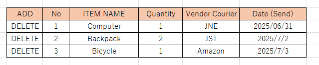
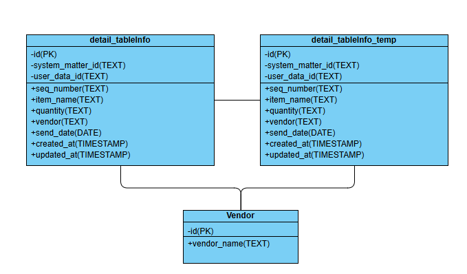

<h1 align="center">Intra Mart</h1>

⬅️
[Back 戻る](../README.md)

<h2 align="left">⭐Table Setup⭐</h2>

##### Example Desain Table 

  

  

Please follow the steps below (以下の手順に従ってください).

<h4 align="left">📖 Apply Action Process （申請処理）</h4>
Create Table　⇒　Create Model ⇒ Create Repository ⇒ Create Service Action 

テーブル作成 ⇒ モデル作成 ⇒ リポジトリ作成 ⇒ サービスアクション作成

<h4 align="left">📖 Process Data　（データ処理）</h4>
Get Data ⇒　Show data

データ取得 ⇒ データ表示

<h4 align="left">📖 Matter End Process　（案件終了処理）</h4>

Create Service MatterEnd ⇒ Update Database

案件終了サービス作成 ⇒ データベース更新
