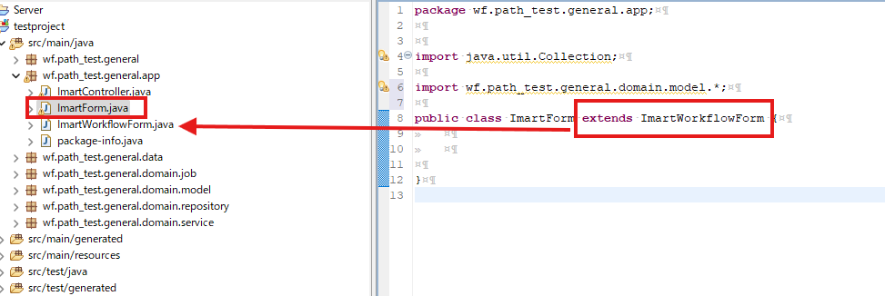

<h1 align="center">Intra Mart</h1>

⬅️
[Back 戻る](../README.md)


<h2 align="left">⭐Source Code Setup⭐</h2>

<p align="center">
  
</p>

Please follow the steps below (以下の手順に従ってください).

パッケージ作成　⇒　画面作成　

1. [Create Package](#create-package)
    - [ActionProcessService.java](#source-code-1)
    - [MatterEndProcessService.java](#source-code-2)
    - [Contoller.java](#source-code-3)
    - [Form.java](#source-code-4)
    - [WorkflowForm.java](#source-code-5)
    - [ActionProcess.java](#source-code-6)
    - [MatterEndProcess.java](#source-code-7)

2. [Views Setup](#create-views)
    - [Beans.xml](#source-code-8)
    - [Sample Code Apply.jsp](#source-code-9)


- [Compile Error Fixing](#error-compile) 


> **Open Project in EBuilder Application, then create a package same as picture below** 

> **eBuilderでの作成されたプロジェクトを開き, その後以下の画像の通りにパッケージを作成** 

##### Create Package

<p align="left">
  
</p>


<p align="left">
  
</p>


<p align="left">
  
</p>

<p align="left">
  
</p>

<p align="left">
  
</p>


<p align="left">
  
</p>


#### Source Code 1

> **ActionProcessService.java** 

```sh
import java.util.Map;
import jp.co.intra_mart.foundation.workflow.plugin.process.action.ActionProcessParameter;


public interface ActionProcessService {

	String apply(final ActionProcessParameter parameter, final Map<String, Object> userParameter) throws Exception;

    String applyFromTempSave(final ActionProcessParameter parameter, final Map<String, Object> userParameter) throws Exception;

    String applyFromUnapply(final ActionProcessParameter parameter, final Map<String, Object> userParameter) throws Exception;

    void approve(final ActionProcessParameter parameter, final Map<String, Object> userParameter) throws Exception;

    void approveEnd(final ActionProcessParameter parameter, final Map<String, Object> userParameter) throws Exception;

    void deny(final ActionProcessParameter parameter, final Map<String, Object> userParameter) throws Exception;

    void discontinue(final ActionProcessParameter parameter, final Map<String, Object> userParameter) throws Exception;

    void matterHandle(final ActionProcessParameter parameter, final Map<String, Object> userParameter) throws Exception;

    void pullBack(final ActionProcessParameter parameter, final Map<String, Object> userParameter) throws Exception;

    String reapply(final ActionProcessParameter parameter, final Map<String, Object> userParameter) throws Exception;
    
    void reserve(final ActionProcessParameter parameter, final Map<String, Object> userParameter) throws Exception;

    void reserveCancel(final ActionProcessParameter parameter, final Map<String, Object> userParameter) throws Exception;

    void sendBack(final ActionProcessParameter parameter, final Map<String, Object> userParameter) throws Exception;

    void sendBackToPullBack(final ActionProcessParameter parameter, final Map<String, Object> userParameter) throws Exception;

    void tempSaveCreate(final ActionProcessParameter parameter, final Map<String, Object> userParameter) throws Exception;

    void tempSaveDelete(final ActionProcessParameter parameter, final Map<String, Object> userParameter) throws Exception;

    void tempSaveUpdate(final ActionProcessParameter parameter, final Map<String, Object> userParameter) throws Exception;
 }


```

#### Source Code 2

> **MatterEndProcessService.java** 

```sh

import jp.co.intra_mart.foundation.workflow.plugin.process.matter_end.MatterEndProcessParameter;

public interface MatterEndProcessService {

    boolean execute(final MatterEndProcessParameter parameter) throws Exception;

}


```


#### Source Code 3


<p align="left">
  
</p>


<p align="left">
  
</p>


<p align="left">
  
</p>


<p align="left">
  
</p>

> **Controller.java** 

```sh


import java.io.FileNotFoundException;
import java.io.IOException;
import java.net.URLDecoder;
import java.util.ArrayList;
import java.util.Collection;
import java.util.List;

import javax.servlet.http.HttpServletRequest;
import javax.servlet.http.HttpServletResponse;

import jp.co.intra_mart.foundation.context.Contexts;
import jp.co.intra_mart.foundation.context.model.ClientContext;
import jp.co.intra_mart.foundation.multi_device.client_type.ClientTypeSwitcher;
import jp.co.intra_mart.foundation.security.exception.AccessSecurityException;
import jp.co.intra_mart.foundation.security.message.MessageManager;
import jp.co.intra_mart.foundation.service.client.file.PublicStorage;
import jp.co.intra_mart.foundation.service.client.information.Identifier;
import jp.co.intra_mart.foundation.ui.page.Transfer.Message;
import jp.co.intra_mart.foundation.workflow.code.PageType;
import jp.co.intra_mart.framework.extension.spring.web.servlet.view.TransferView;

import com.fasterxml.jackson.databind.ObjectMapper;

import org.springframework.stereotype.Controller;
import org.springframework.ui.Model;
import org.springframework.web.bind.annotation.ExceptionHandler;
import org.springframework.web.bind.annotation.PostMapping;
import org.springframework.web.bind.annotation.RequestMapping;
import org.springframework.web.bind.annotation.RequestMethod;
import org.springframework.web.bind.annotation.RequestParam;
import org.springframework.web.bind.annotation.ResponseBody;
import org.springframework.web.servlet.HandlerMapping;
import org.springframework.web.servlet.ModelAndView;

@Controller
@RequestMapping("path_test/")
public class ImartController {
	
	
	

}


```


#### Source Code 4

> **Form.java** 

```sh


import java.util.Collection;

import wf.path_test.general.domain.model.*;

public class ImartForm extends ImartWorkflowForm {
	
	

}


```


#### Source Code 5

> **WorkflowForm.java** 

```sh


public class ImartWorkflowForm {
	

	private String imwGroupId;

    private String imwUserCode;

    private String imwPageType;

    private String imwUserDataId;

    private String imwSystemMatterId;

    private String imwNodeId;

    private String imwArriveType;

    private String imwAuthUserCode;

    private String imwApplyBaseDate;

    private String imwContentsId;

    private String imwContentsVersionId;

    private String imwRouteId;

    private String imwRouteVersionId;

    private String imwFlowId;

    private String imwFlowVersionId;

    private String imwCallOriginalParams;

    private String imwCallOriginalPagePath;

    private String imwSysDateTargetExpandFlag;

    private String imwShortCutFlag;

    public String getImwApplyBaseDate() {
        return imwApplyBaseDate;
    }

    public String getImwArriveType() {
        return imwArriveType;
    }

    public String getImwAuthUserCode() {
        return imwAuthUserCode;
    }

    public String getImwCallOriginalPagePath() {
        return imwCallOriginalPagePath;
    }

    public String getImwCallOriginalParams() {
        return imwCallOriginalParams;
    }

    public String getImwContentsId() {
        return imwContentsId;
    }

    public String getImwContentsVersionId() {
        return imwContentsVersionId;
    }

    public String getImwFlowId() {
        return imwFlowId;
    }

    public String getImwFlowVersionId() {
        return imwFlowVersionId;
    }

    public String getImwGroupId() {
        return imwGroupId;
    }

    public String getImwNodeId() {
        return imwNodeId;
    }

    public String getImwPageType() {
        return imwPageType;
    }

    public String getImwRouteId() {
        return imwRouteId;
    }

    public String getImwRouteVersionId() {
        return imwRouteVersionId;
    }

    public String getImwShortCutFlag() {
        return imwShortCutFlag;
    }

    public String getImwSysDateTargetExpandFlag() {
        return imwSysDateTargetExpandFlag;
    }

    public String getImwSystemMatterId() {
        return imwSystemMatterId;
    }

    public String getImwUserCode() {
        return imwUserCode;
    }

    public String getImwUserDataId() {
        return imwUserDataId;
    }

    public void setImwApplyBaseDate(final String imwApplyBaseDate) {
        this.imwApplyBaseDate = imwApplyBaseDate;
    }

    public void setImwArriveType(final String imwArriveType) {
        this.imwArriveType = imwArriveType;
    }

    public void setImwAuthUserCode(final String imwAuthUserCode) {
        this.imwAuthUserCode = imwAuthUserCode;
    }

    public void setImwCallOriginalPagePath(final String imwCallOriginalPagePath) {
        this.imwCallOriginalPagePath = imwCallOriginalPagePath;
    }

    public void setImwCallOriginalParams(final String imwCallOriginalParams) {
        this.imwCallOriginalParams = imwCallOriginalParams;
    }

    public void setImwContentsId(final String imwContentsId) {
        this.imwContentsId = imwContentsId;
    }

    public void setImwContentsVersionId(final String imwContentsVersionId) {
        this.imwContentsVersionId = imwContentsVersionId;
    }

    public void setImwFlowId(final String imwFlowId) {
        this.imwFlowId = imwFlowId;
    }

    public void setImwFlowVersionId(final String imwFlowVersionId) {
        this.imwFlowVersionId = imwFlowVersionId;
    }

    public void setImwGroupId(final String imwGroupId) {
        this.imwGroupId = imwGroupId;
    }

    public void setImwNodeId(final String imwNodeId) {
        this.imwNodeId = imwNodeId;
    }

    public void setImwPageType(final String imwPageType) {
        this.imwPageType = imwPageType;
    }

    public void setImwRouteId(final String imwRouteId) {
        this.imwRouteId = imwRouteId;
    }

    public void setImwRouteVersionId(final String imwRouteVersionId) {
        this.imwRouteVersionId = imwRouteVersionId;
    }

    public void setImwShortCutFlag(final String imwShortCutFlag) {
        this.imwShortCutFlag = imwShortCutFlag;
    }

    public void setImwSysDateTargetExpandFlag(final String imwSysDateTargetExpandFlag) {
        this.imwSysDateTargetExpandFlag = imwSysDateTargetExpandFlag;
    }

    public void setImwSystemMatterId(final String imwSystemMatterId) {
        this.imwSystemMatterId = imwSystemMatterId;
    }

    public void setImwUserCode(final String imwUserCode) {
        this.imwUserCode = imwUserCode;
    }

    public void setImwUserDataId(final String imwUserDataId) {
        this.imwUserDataId = imwUserDataId;
    }
	
	

}


```


#### Source Code 6


<p align="left">
  
</p>


> **In this part you need to ensure the path are same.** 

> **コンテンツ定義での作成されたパースを確認、同じようにパッケージを作成してください** 


<p align="left">
  
</p>


> **ActionProcess.java** 

```sh


import java.util.Map;


import jp.co.intra_mart.foundation.workflow.application.model.HorizontalAndVerticalNodeConfigModel;
import jp.co.intra_mart.foundation.workflow.plugin.process.action.ActionProcessEventListener;
import jp.co.intra_mart.foundation.workflow.plugin.process.action.ActionProcessParameter;
import jp.co.intra_mart.foundation.workflow.util.WorkflowNumberingManager;
import jp.co.intra_mart.framework.extension.spring.context.ApplicationContextProvider;


//Import from General Package
import wf.path_test.general.ActionProcessService;

public class ActionProcess extends ActionProcessEventListener  {

    // 申請
    @Override
    public final String apply(final ActionProcessParameter parameter, final Map<String, Object> userParameter) throws Exception {
        // アクション処理用のサービスを取得します。
        final ActionProcessService service = ApplicationContextProvider.getApplicationContext().getBean(ActionProcessService.class);
        return service.apply(parameter, userParameter);
        
    }

    // 申請（一時保存）
    @Override
    public final String applyFromTempSave(final ActionProcessParameter parameter, final Map<String, Object> userParameter) throws Exception {
        // アクション処理用のサービスを取得します。
        final ActionProcessService service = ApplicationContextProvider.getApplicationContext().getBean(ActionProcessService.class);
        return service.applyFromTempSave(parameter, userParameter);
    }

    // 申請(未申請状態案件)
    @Override
    public final String applyFromUnapply(final ActionProcessParameter parameter, final Map<String, Object> userParameter) throws Exception {
        // アクション処理用のサービスを取得します。
        final ActionProcessService service = ApplicationContextProvider.getApplicationContext().getBean(ActionProcessService.class);
        return service.applyFromUnapply(parameter, userParameter);
    }

    // 承認
    @Override
    public void approve(final ActionProcessParameter parameter, final Map<String, Object> userParameter) throws Exception {
        // アクション処理用のサービスを取得します。
        final ActionProcessService service = ApplicationContextProvider.getApplicationContext().getBean(ActionProcessService.class);
        
        service.approve(parameter, userParameter);
    }

    // 承認終了
    @Override
    public final void approveEnd(final ActionProcessParameter parameter, final Map<String, Object> userParameter) throws Exception {
        // アクション処理用のサービスを取得します。
        final ActionProcessService service = ApplicationContextProvider.getApplicationContext().getBean(ActionProcessService.class);
        service.approveEnd(parameter, userParameter);
    }

    // 否認
    @Override
    public final void deny(final ActionProcessParameter parameter, final Map<String, Object> userParameter) throws Exception {
        // アクション処理用のサービスを取得します。
        final ActionProcessService service = ApplicationContextProvider.getApplicationContext().getBean(ActionProcessService.class);
        service.deny(parameter, userParameter);
    }

    // 取止め
    @Override
    public final void discontinue(final ActionProcessParameter parameter, final Map<String, Object> userParameter) throws Exception {
        // アクション処理用のサービスを取得します。
        final ActionProcessService service = ApplicationContextProvider.getApplicationContext().getBean(ActionProcessService.class);
        service.discontinue(parameter, userParameter);
    }

    // 案件操作
    @Override
    public final void matterHandle(final ActionProcessParameter parameter, final Map<String, Object> userParameter) throws Exception {
        // アクション処理用のサービスを取得します。
        final ActionProcessService service = ApplicationContextProvider.getApplicationContext().getBean(ActionProcessService.class);
        service.matterHandle(parameter, userParameter);
    }

    // 引戻し
    @Override
    public final void pullBack(final ActionProcessParameter parameter, final Map<String, Object> userParameter) throws Exception {
        // アクション処理用のサービスを取得します。
        final ActionProcessService service = ApplicationContextProvider.getApplicationContext().getBean(ActionProcessService.class);
        service.pullBack(parameter, userParameter);
    }

    // 再申請
    @Override
    public final String reapply(final ActionProcessParameter parameter, final Map<String, Object> userParameter) throws Exception {
        // アクション処理用のサービスを取得します。
        final ActionProcessService service = ApplicationContextProvider.getApplicationContext().getBean(ActionProcessService.class);
        return service.reapply(parameter, userParameter);
    }

    // 保留
    @Override
    public final void reserve(final ActionProcessParameter parameter, final Map<String, Object> userParameter) throws Exception {
        // アクション処理用のサービスを取得します。
        final ActionProcessService service = ApplicationContextProvider.getApplicationContext().getBean(ActionProcessService.class);
        service.reserve(parameter, userParameter);
    }

    // 保留解除
    @Override
    public final void reserveCancel(final ActionProcessParameter parameter, final Map<String, Object> userParameter) throws Exception {
        // アクション処理用のサービスを取得します。
        final ActionProcessService service = ApplicationContextProvider.getApplicationContext().getBean(ActionProcessService.class);
        service.reserveCancel(parameter, userParameter);
    }

    // 差戻し
    @Override
    public final void sendBack(final ActionProcessParameter parameter, final Map<String, Object> userParameter) throws Exception {
        // アクション処理用のサービスを取得します。
        final ActionProcessService service = ApplicationContextProvider.getApplicationContext().getBean(ActionProcessService.class);
        service.sendBack(parameter, userParameter);
    }

    // 差戻し後引戻し
    @Override
    public final void sendBackToPullBack(final ActionProcessParameter parameter, final Map<String, Object> userParameter) throws Exception {
        final ActionProcessService service = ApplicationContextProvider.getApplicationContext().getBean(ActionProcessService.class);
        service.sendBackToPullBack(parameter, userParameter);
    }

    // 一時保存(新規登録)
    @Override
    public final void tempSaveCreate(final ActionProcessParameter parameter, final Map<String, Object> userParameter) throws Exception {
        // アクション処理用のサービスを取得します。
        final ActionProcessService service = ApplicationContextProvider.getApplicationContext().getBean(ActionProcessService.class);
        service.tempSaveCreate(parameter, userParameter);
    }

    // 一時保存(削除)
    @Override
    public final void tempSaveDelete(final ActionProcessParameter parameter, final Map<String, Object> userParameter) throws Exception {
        // アクション処理用のサービスを取得します。
        final ActionProcessService service = ApplicationContextProvider.getApplicationContext().getBean(ActionProcessService.class);
        service.tempSaveDelete(parameter, userParameter);
    }

    // 一時保存(更新)
    @Override
    public final void tempSaveUpdate(final ActionProcessParameter parameter, final Map<String, Object> userParameter) throws Exception {
        // アクション処理用のサービスを取得します。
        final ActionProcessService service = ApplicationContextProvider.getApplicationContext().getBean(ActionProcessService.class);
        service.tempSaveUpdate(parameter, userParameter);
    }
}
```


#### Source Code 7

> **MatterEndProcess.java** 

```sh


import jp.co.intra_mart.foundation.workflow.plugin.process.matter_end.MatterEndProcessEventListener;
import jp.co.intra_mart.foundation.workflow.plugin.process.matter_end.MatterEndProcessParameter;
import jp.co.intra_mart.framework.extension.spring.context.ApplicationContextProvider;

//Import from General
import wf.path_test.general.MatterEndProcessService;

public class MatterEndProcess extends MatterEndProcessEventListener {

    public MatterEndProcess() {
        super();
    }

    @Override
    public boolean execute(final MatterEndProcessParameter parameter) throws Exception {
        final MatterEndProcessService service = ApplicationContextProvider.getApplicationContext().getBean(MatterEndProcessService.class);
        return service.execute(parameter);
    }
}


```


#### Create Views


> **Because we are using Intra-Mart (Upgraded Spring Version), we need to create views folder** 

> **Intra-Mart（最新Springバージョン）を使用するため、Viewsフォルダを作成しないといけない** 


<p align="left">
  
</p>

<p align="left">
  
</p>

<p align="left">
  
</p>

<p align="left">
  
</p>

<p align="left">
  
</p>

<p align="left">
  
</p>


#### Source Code 8


<p align="left">
  
</p>

> **applicationContext-path.java** 

> **Base-package need to be same as created package** 

> **ベースパッケージのところに前回の作成されたパッケージフォルダ名の確認が必要** 


```sh


<?xml version="1.0" encoding="UTF-8"?>
<beans xmlns="http://www.springframework.org/schema/beans"
	xmlns:xsi="http://www.w3.org/2001/XMLSchema-instance"
	xmlns:context="http://www.springframework.org/schema/context"
	xmlns:mybatis="http://mybatis.org/schema/mybatis-spring"
	xsi:schemaLocation="http://www.springframework.org/schema/beans http://www.springframework.org/schema/beans/spring-beans.xsd
    http://www.springframework.org/schema/context http://www.springframework.org/schema/context/spring-context.xsd
    http://mybatis.org/schema/mybatis-spring http://mybatis.org/schema/mybatis-spring.xsd">

	<context:component-scan base-package="wf.path_test" />

</beans>

```


<p align="left">
  
</p>

<p align="left">
  
</p>


#### Source Code 9


<p align="left">
  
</p>


> **apply.jsp** 

```sh


<html>
<head>
  <style>
    .centered-image {
      display: block;
      margin-left: auto;
      margin-right: auto;
      margin-top: 20px;
      max-width: 80%;
      height: auto;
    }
  </style>
</head>
<body>

<h1>Simple Apply View Test</h1>


<p>Welcome to Intra Mart.</p>

</body>
</html>


```


#### Source Code 10


<p align="left">
  
</p>


> **ApplyController.Java** 

```sh

	@RequestMapping(value = "apply")
	public final String apply(final Model model, final ImartForm ApplyForm) throws Exception {
		
		
		if (PageType.pageTyp_App.toString().equals(ApplyForm.getImwPageType())) {
			String userDataId = "";
			final Identifier identifier = new Identifier();
			userDataId = identifier.get();
			
			ApplyForm.setImwUserDataId(userDataId);
			
			
		} else if (PageType.pageTyp_UnApp.toString().equals(ApplyForm.getImwPageType())) {
		
		} else {
			
			
		}
		
		
		model.addAttribute("ApplyForm", ApplyForm);
		return "wf/path_test/general/apply.jsp";
	}


```

<h3 align="center">🚩🚩Important Things (重要)🚩🚩</h3>

> **Ensure Restart Server After Create Controller Endpoint** 

> **コントロールでの関数を作成した後、サーバーの再起動が必要** 


<p align="left">
  
</p>


<p align="left">
  
</p>


<h2 align="center">⭐END of Source Code Setup⭐</h2>

➡️
[CRUD Setup CRUD設定](../db_setup/database.md)

⬅️
[Back to README 戻る](../README.md)


<h3 align="left">🚩🚩Error Fixing🚩🚩</h3>

> **Error Controller Compiled Version** 

> **コントロールでのエラーが発生しました** 

##### Error Compile

<p align="left">
  
</p>


> **Project > Properties > Java Compile** 

> **プロジェクト　⇒　プロパティ　⇒　Javaコンパイラー** 


<p align="left">
  
</p>


