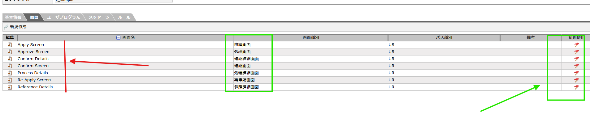

<h1 align="center">Intra Mart</h1>

⬅️
[Back 戻る](../README.md)

<h2 align="left">⭐Worfkflow Setup⭐</h2>

Need to Follow Step Bellow (以下の流れ手順にご覧ください。)

ユーザー登録　⇒　コンテンツ定義　⇒　ルート定義　⇒　フロー定義

1. [User Register](#user-register)
2. [Content Definition](#content-definition)
     - [Screen Register](#screen-register)
     - [User Program](#user-program)
3. [Route Definition](#route-definition)
4. [Flow Definition](#flow-definition)

<h3 align="center">📖 User Register (ユーザー登録)📖</h3>

##### User Register

  

  

> **Input Public Group name** 

> **パブリックグループ名を記入** 

  

  

  

  

  

  

  

  

  

  

> **Ensure Tenant's Account Role, Public Group** 

> **Tenantアカウントを確認、（ロール、パブリックグループ）** 

  

  

<h3 align="center">📖 Content Definition (コンテンツ定義)📖</h3>

##### Content Definition

  

  

  

  

  

##### Screen Register

  

  

  

  

  

  

  

  

  

##### User Program

  

  

  

  

<h3 align="center">📖 Route Definition (ルート定義)📖</h3>

##### Route Definition

  

  

  

  

  

  

  

  

  

  

  

<h3 align="center">📖 Flow Definition (フロー定義)📖</h3>

##### Flow Definition

  

  

  

  

  

